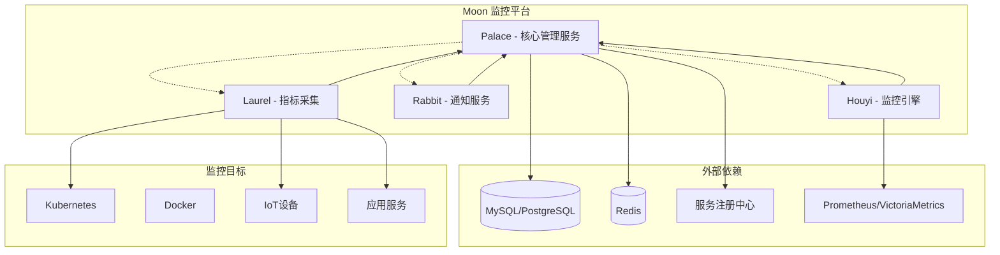
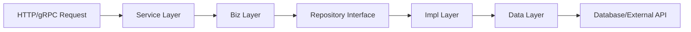

# Moon 项目介绍与入门手册

<div style="display: flex; align-items: center;">
  
  <h1 style="margin: 0; font-size: 24px; line-height: 1.5;">Moon - 多领域监控告警平台</h1>
</div>

## 🌟 项目概述

Moon 是一个为现代技术栈设计的监控和告警平台，专为云原生、物联网（IoT）和人工智能（AI）应用提供全面的监控解决方案。它采用微服务架构，基于 Go 语言开发，使用 Kratos 框架构建。

### 设计理念
- **简单 (Simple)**: 简化监控运维操作
- **智能 (Smart)**: 内置 AI 算法支持异常检测和趋势预测
- **高效 (Efficient)**: 确保系统稳定性和高可观测性

## 🏗️ 系统架构

Moon 采用微服务架构，由四个核心服务组成：

### 核心服务架构图



### 1. Palace (核心管理服务) 🏰

**定位**: 系统的管理中心和控制平面
- **主要功能**:
  - 用户认证与授权管理
  - 团队和权限管理
  - 监控策略配置
  - 数据源管理
  - 仪表板配置
  - 系统配置管理
- **技术特点**:
  - 多租户架构支持
  - 动态数据库配置
  - 服务间通信协调
  - RESTful API 和 gRPC 双协议支持

### 2. Houyi (监控引擎) 🏹

**定位**: 实时监控和告警评估引擎
- **主要功能**:
  - 实时指标评估
  - 告警规则执行
  - 时间序列数据处理
  - 异常检测算法
  - 告警事件生成
- **技术特点**:
  - 支持多种数据源 (Prometheus、VictoriaMetrics)
  - 高性能时间序列计算
  - 插件化的评估引擎
  - 分布式告警处理

### 3. Rabbit (通知服务) 🐰

**定位**: 多渠道通知和消息分发服务
- **主要功能**:
  - 邮件通知发送
  - 短信通知发送
  - Webhook 集成
  - 消息队列处理
  - 通知模板管理
- **技术特点**:
  - 多通道消息发送
  - 消息去重和限流
  - 模板化消息内容
  - 异步消息处理

### 4. Laurel (指标采集) 🍃

**定位**: 指标采集和脚本执行服务
- **主要功能**:
  - 自定义脚本执行
  - 指标数据采集
  - 多语言脚本支持 (Python、Shell、Bash)
  - 定时任务调度
- **技术特点**:
  - 灵活的脚本命名约定
  - 多解释器支持
  - JSON 格式数据输出
  - 定时间隔配置

## 🔧 技术栈

### 后端技术
- **语言**: Go 1.21+
- **框架**: Kratos v2 (微服务框架)
- **API**: Protocol Buffers + gRPC/HTTP
- **数据库**: MySQL/PostgreSQL + GORM
- **缓存**: Redis
- **服务发现**: Consul/Etcd
- **监控**: Prometheus/VictoriaMetrics

### 开发工具
- **依赖注入**: Google Wire
- **代码生成**: protoc-gen-*
- **构建工具**: Make
- **容器化**: Docker
- **编排**: Kubernetes

### 项目结构
```
moon/
├── cmd/                    # 微服务入口
│   ├── palace/            # 管理服务
│   ├── houyi/             # 监控引擎
│   ├── rabbit/            # 通知服务
│   └── laurel/            # 指标采集
├── pkg/                   # 共享包
│   ├── api/              # API 定义
│   ├── plugin/           # 插件系统
│   └── util/             # 工具函数
├── proto/                 # Protocol Buffers 定义
├── deploy/               # 部署配置
├── scripts/              # 脚本文件
└── i18n/                 # 国际化
```

## 🚀 快速开始

### 前置条件

1. **开发环境**:
   ```bash
   # Go 版本要求
   go version >= 1.21
   
   # 安装必要工具
   make init
   ```

2. **基础设施**:
   ```bash
   # 启动依赖服务
   cd deploy
   
   # 启动 MySQL
   docker-compose -f mysql/docker-compose.yml up -d
   
   # 启动 Redis
   docker-compose -f redis/docker-compose.yml up -d
   
   # 启动 Etcd (服务注册)
   docker-compose -f etcd/docker-compose.yml up -d
   
   # 启动 Prometheus (可选)
   docker-compose -f prometheus/docker-compose.yml up -d
   ```

### 本地开发

1. **初始化项目**:
   ```bash
   # 生成所有代码
   make all
   ```

2. **启动服务**:
   ```bash
   # 启动 Palace (管理服务)
   make run app=palace
   
   # 启动 Houyi (监控引擎)
   make run app=houyi
   
   # 启动 Rabbit (通知服务)
   make run app=rabbit
   
   # 启动 Laurel (指标采集)
   make run app=laurel
   ```

3. **数据库迁移**:
   ```bash
   # 执行数据库迁移
   make migrate-table app=palace
   ```

### 配置说明

每个服务都有独立的配置目录：

```
cmd/{service}/config/
├── config.yaml        # 主配置
├── server.yaml        # 服务器配置
├── auth.yaml          # 认证配置
├── log.yaml           # 日志配置
└── i18n.yaml          # 国际化配置
```

## 📖 核心功能详解

### 1. 监控策略配置

通过 Palace 服务配置监控策略：
- 定义监控指标和阈值
- 设置告警规则和条件
- 配置通知渠道和接收人
- 管理监控数据源

### 2. 实时监控评估

Houyi 服务提供：
- 实时指标数据评估
- 多维度告警触发
- 智能异常检测
- 历史数据分析

### 3. 多渠道通知

Rabbit 服务支持：
- 邮件通知
- 短信通知
- Webhook 集成
- 自定义通知模板

### 4. 自定义指标采集

Laurel 服务实现：
- 脚本化指标采集
- 多语言支持
- 灵活的执行调度
- 标准化数据输出

### 脚本命名约定

Laurel 使用特殊的文件命名约定来识别脚本：

```
{执行间隔}_{解释器类型}_{脚本名称}.{扩展名}
```

示例：
- `5s_bash_hello.sh` - 每5秒执行的Bash脚本
- `10s_python3_hello3.py` - 每10秒执行的Python3脚本
- `1m_sh_system_metrics.sh` - 每分钟执行的Shell脚本

## 🔄 DDD 分层架构

项目采用 mini DDD（领域驱动设计）架构：

```
service -> biz -> repository -> impl -> data
```

### 分层说明

1. **API 层**: 接口定义（proto/pb）
2. **Service 层**: 服务入口，参数校验和转换
3. **Biz 层**: 业务逻辑实现
   - bo: 业务对象
   - do: 数据对象
   - repository: 仓储接口
   - vobj: 值对象
4. **Data 层**: 数据访问和外部服务

### 数据流转



## 🛠️ 开发指南

### 添加新功能

1. **定义 API**:
   ```bash
   # 在 proto/api/{service}/ 目录下添加 .proto 文件
   # 生成代码
   make api app={service}
   ```

2. **实现业务逻辑**:
   ```bash
   # 在 cmd/{service}/internal/biz/ 下实现业务逻辑
   # 在 cmd/{service}/internal/service/ 下实现服务层
   ```

3. **数据访问层**:
   ```bash
   # 在 cmd/{service}/internal/data/ 下实现数据访问
   ```

4. **依赖注入**:
   ```bash
   # 更新 provider_set.go 文件
   # 重新生成 wire
   make wire-{service}
   ```

### 测试

```bash
# 运行单元测试
go test ./...

# 运行特定服务测试
go test ./cmd/{service}/...
```

### 构建和部署

```bash
# 构建服务
make build app={service}

# 构建 Docker 镜像
make docker-build app={service}

# 使用 Kubernetes 部署
kubectl apply -f deploy/
```

## 📊 监控和观测

### 内置监控

- **服务健康检查**: 每个服务都提供健康检查端点
- **指标收集**: 内置 Prometheus 指标
- **链路追踪**: 支持 OpenTelemetry
- **日志记录**: 结构化日志输出

### 监控指标

- 服务可用性和响应时间
- 业务指标和告警数量
- 系统资源使用情况
- 数据库连接和查询性能

## 🌍 国际化支持

Moon 支持多语言：
- 中文 (zh)
- 英文 (en)
- 日文 (ja)

配置文件位于 `i18n/` 目录下。

## 🚀 生产环境部署

### Docker 部署

```bash
# 构建镜像
make docker-build app=palace
make docker-build app=houyi
make docker-build app=rabbit
make docker-build app=laurel

# 使用 docker-compose 部署
docker-compose up -d
```

### Kubernetes 部署

```bash
# 部署到 K8s 集群
kubectl apply -f deploy/k8s/
```

### 配置建议

1. **数据库配置**: 
   - 使用读写分离
   - 配置连接池
   - 启用数据库监控

2. **缓存配置**:
   - Redis 集群模式
   - 适当的过期策略
   - 监控内存使用

3. **服务配置**:
   - 合理的超时设置
   - 限流和熔断配置
   - 健康检查配置

## 🤝 贡献指南

1. **阅读文档**: 
   - [GOPHER.md](./docs/dev/GOPHER.md)
   - [DEV.md](./docs/dev/DEV.md)
   - [COMMIT.md](./docs/dev/COMMIT.md)

2. **提交问题**: 在 [Issues](https://github.com/aide-family/moon/issues) 中提交

3. **代码贡献**: 
   - Fork 项目
   - 创建功能分支
   - 提交 Pull Request
   - 确保通过所有测试

4. **代码规范**:
   - 遵循 Go 语言规范
   - 添加必要的注释
   - 编写单元测试
   - 更新相关文档

## 📞 社区支持

- **GitHub**: [https://github.com/aide-family/moon](https://github.com/aide-family/moon)
- **文档**: [https://aide-family.github.io](https://aide-family.github.io)
- **论坛**: [GitHub Discussions](https://github.com/aide-family/moon/discussions)
- **Discord**: [加入我们](https://discord.gg/rQT7psPESG)
- **飞书群**: [开发者群](https://applink.feishu.cn/client/chat/chatter/add_by_link?link_token=386t3219-195d-4e4d-a11c-0f1bbcb1d705)

## 📄 许可证

Moon 基于 [MIT 许可证](LICENSE) 开源，您可以自由使用和修改。

---

**Moon - 简化监控，赋能运维。**

感谢您对 Moon 项目的关注和支持！如果您有任何问题或建议，欢迎通过上述渠道与我们联系。