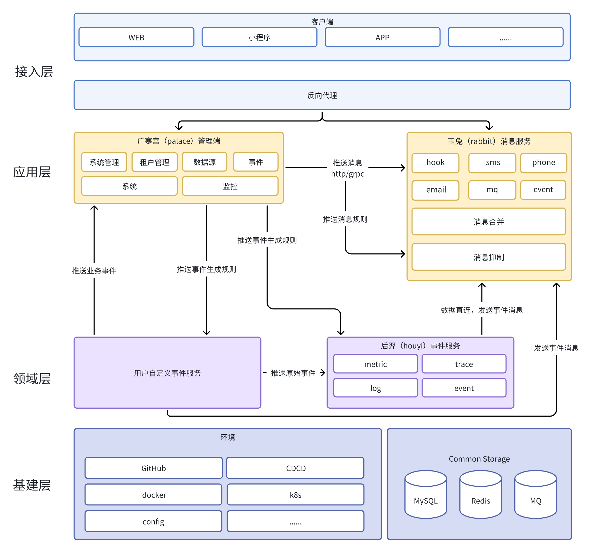

# Moon 监控系统

## 介绍

* [英文](README.md)

一款始于prometheus，不止于prometheus的一站式监控系统， 专为简化云原生监控的运维工作而设计， 旨在帮助企业快速部署云原生监控系统， 降低运维成本， 提升运维效率。

## 架构

## 开发者

* [开发文档](https://byiraveryh.feishu.cn/docx/NDdadBoeoo7JWuxCMjIc3RtinTe?from=from_copylink)