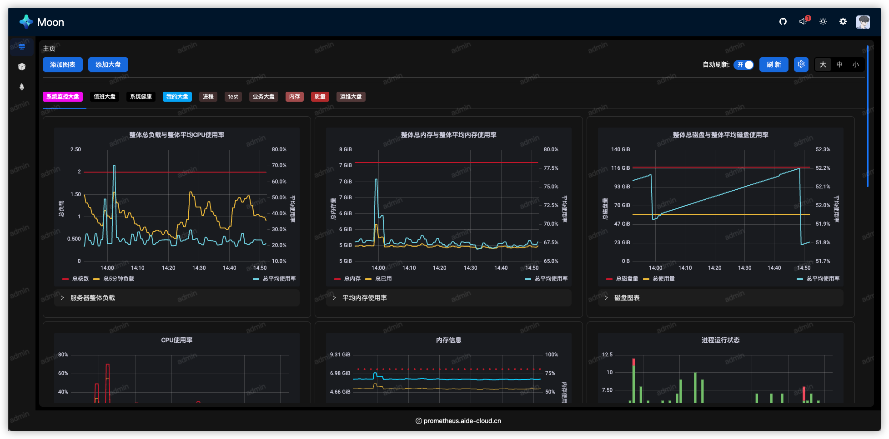
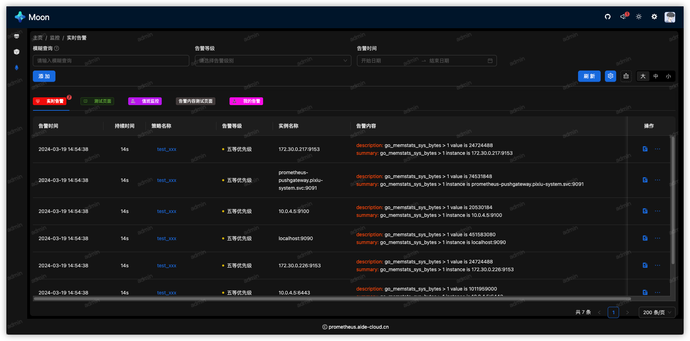
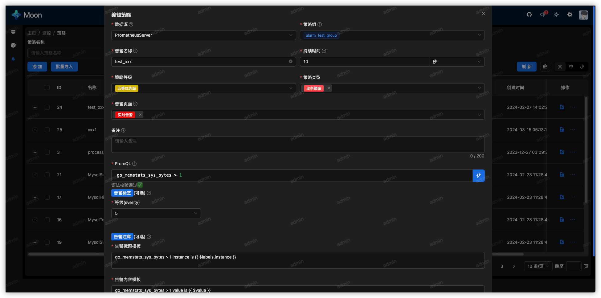
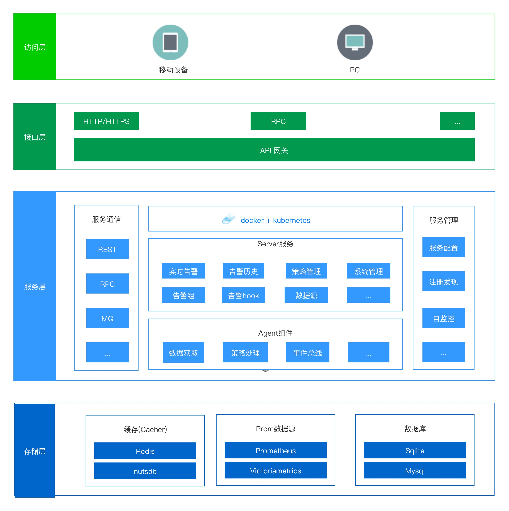

<div align="center">
<h1 style="color: #1677ff; font-size: 64px">Moon 监控平台</h1>
<h2>始于prometheus，不止于prometheus</h2>
<span>


</span>

[](https://github.com/aide-family/moon)
[](https://github.com/aide-family/moon/releases)
[](https://github.com/aide-family/moon/pulls)
[](https://github.com/aide-family/moon/pulls?q=is%3Apr+is%3Aclosed)
[](https://github.com/aide-family/moon/issues)
[](https://github.com/aide-family/moon/issues?q=is%3Aissue+is%3Aclosed)


</div>

## 1. 概述

> 在漫长黑夜中守护你的一轮明月

### 项目简介

  Moon 是一款集成prometheus系列的监控管理工具，专为简化Prometheus监控系统的运维工作而设计。该工具提供了一站式的解决方案，能够集中管理和配置多个Prometheus实例及其相关的服务发现、规则集和警报通知。
  * [官方文档](https://aide-family.github.io/i18n/zh/)
  * [相关博文](https://juejin.cn/post/7329734768258760719)

### UI展示

* 系统大盘


* 实时告警


* 告警策略


* 策略编辑


### 在线体验
  * 环境地址https://prometheus.aide-cloud.cn/

  * 用户名：prometheus
  * 密码：123456


  * 用户名：num1
  * 密码：68b329da9893e34099c7d8ad5cb9c940

### 系统架构
  

## 2. 快速开始

### 2.1 系统要求

* 操作系统：Linux、macOS、Windows
* Go语言环境：Go 1.20+
* Docker (可选，用于快速部署)
* K8s (暂时未尝试)
* 环境依赖：
  * mysql数据库：8.0+（可选）
  * redis数据库（可选）
  * kafka消息队列（可选）
  <p style="color: red">注意:</p>
  <p>如果没有这些环境，可以直接进入`./deploy/rely`录下， 执行`docker-compose up -d`启动本地默认依赖, 该依赖包含了mysql，redis，kafka等，你可以选择屏蔽掉redis和kafka， 只启动mysql部分</p>

### 2.2 安装部署

#### docker 部署

  > 镜像仓库地址：https://hub.docker.com/repositories/aidemoonio

  * 拉取镜像

  ```shell
  # agent
  docker pull aidemoonio/moon-agent:latest
  # server
  docker pull aidemoonio/moon-server:latest
  ```

  * 启动服务

  ```shell
  # server
  docker run -d --name moon-server \
  -p 8001:8000 \
  -p 8888:8888 \
  -p 8000:80 \
  -v ./moon/server/db:/app/db \
  -v ./moon/server/cache:/app/cache \
  -v ./moon/server/log:/app/log \
  aidemoonio/moon-server:latest 
  
  # agent
  docker run -d --name moon-agent \
  -p 8002:8000 \
  -v ./moon/agent/cache:/app/cache \
  -v ./moon/agent/log:/app/log \
  aidemoonio/moon-agent:latest
  ```

  * 访问服务

  本地访问地址：http://localhost:8000/
  其他IP访问需要配置nginx，参考[nginx](./doc/nginx.conf)

#### docker-compose 部署

  * 1. 使用默认配置部署

  ```yaml
  # docker-compose.yaml
  version: "3.8"
  services:
    moon-server:
      image: aidemoonio/moon-server:latest
      volumes:
        - "./moon/server/db:/app/db"
        - "./moon/server/cache:/app/cache"
        - "./moon/server/log:/app/log"
      ports:
        - "8000:80"
        - "8001:8000"
        - "8888:8888"
    moon-agent:
      image: aidemoonio/moon-agent:latest
      volumes:
        - "./moon/agent/cache:/app/cache"
        - "./moon/agent/log:/app/log"
      ports:
        - "8002:8000"
      depends_on:
        - moon-server
  ```
  
  * 2. 启动

  ```shell
  docker-compose up -d
  # 查看
  docker-compose ps
  ```

#### k8s 部署

* 1. 使用默认配置部署

  ```shell
  kubectl apply -f ./_output/yamls/moon.yaml
  ```

* 2. 自定义部署，生成部署文件

  ```shell
  # 镜像需要更换成你自己的镜像
  make deploy-yaml
  kubectl apply -f ./_output/yamls/moon.yaml
  # or
  make deploy
  ```
* 访问服务

>服务端口通过NodePort暴露
> 
>本地访问moon-server所在的宿主机IP：http://宿主机IP:31008/
> 
>用户名:admin
> 
>密码: 123456

#### helm部署
参考[/deploy/helm](./deploy/.README.md)
## 3. 功能详解

### 3.1 系统管理

#### 用户管理

* 功能说明：

主要管理用户信息，包括新增、修改、删除等操作。该系统不提供用户注册功能，用户信息由管理员添加。

* 注意事项：

无

#### 角色管理

* 功能说明：

主要管理角色信息，包括新增、修改、删除等操作。通过权限和角色绑定，实现权限控制，精确到接口粒度。
采用RBAC模式实现，具体请参见[RBAC](https://casbin.org/zh/docs/rbac)。

* 注意事项：

无

#### 权限管理

* 功能说明：

主要管理权限信息，包括新增、修改、删除等操作。这里维护系统全部需要权限控制的接口。系统新增接口， 需要再次录入到权限管理中。

#### 字典管理

* 功能说明：

主要管理字典信息，包括新增、修改、删除等操作。字典信息主要用于系统中需要使用到的枚举值，比如状态、类型、告警等级等。

### 3.2 告警配置

* 功能说明：

主要维护告警规则组、告警规则，通过表单方式维护prometheus规则信息，并支持多数据源场景，我们在配置规则时候，可以选择不同数据源，编写不同的报警规则，完成告警规则配置。
同时，还支持配置报警页面，告警事件发生后，能够把相同类型的各种规则事件归类到同一个报警页面，帮助我们运维同学集中处理告警。

### 3.3 实时告警

* 功能说明：

主要是展示产生的告警数据，并按照不同报警页面分类展示。每一条告警数据除了展示基本信息外， 还可以展示持续时常，支持告警静默、强制删除、告警升级等操作。

### 3.4 历史告警

* 功能说明：

主要用于查询历史告警，提供统计数据大盘，为复盘提供数据支撑

### 3.5 告警通知

* 功能说明：

主要提供报警组、报警hook等通信方式维护，为报警策略提供通知对象数据。

## 4. 功能TODO

## 5. 常见问题解答

## 6. 贡献者

这个项目的存在要感谢所有做出贡献的人。 [[Contributors](https://github.com/aide-family/moon/graphs/contributors)].

<a href="https://github.com/aide-family/moon/graphs/contributors"></a>

## 7. Star 历史

[](https://star-history.com/#aide-family/moon&Date)

* 2024年4月12日 上午 10:44 start 破100
  


## 讨论


