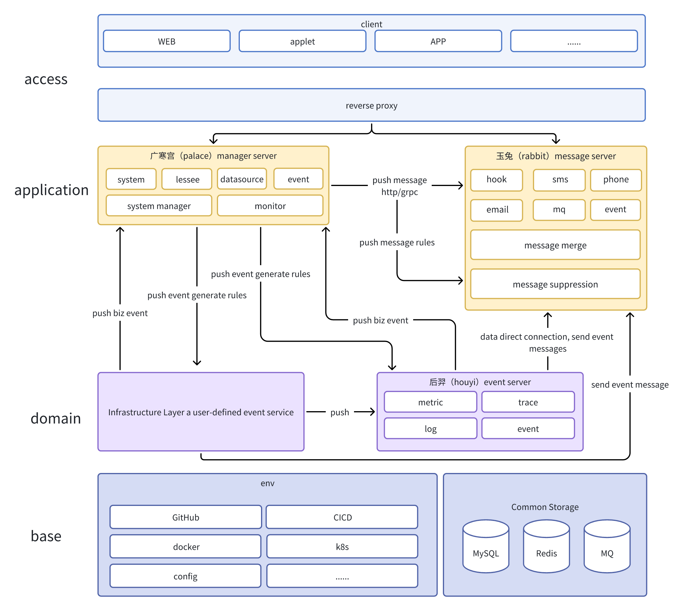

# Moon

## Introduction

* [中文](README-zh.md)

A one-stop monitoring system started with prometheus and ultimately beyond prometheus, designed to simplify the operation and maintenance of cloud-native monitoring, designed to help enterprises quickly deploy cloud-native monitoring systems, reduce operation costs, and improve operation and maintenance efficiency.

## Architecture

## Demo URL
Access our online demo: [Demo URL](https://moon.aide-cloud.cn/)

> Note: The data in the demo environment may be reset periodically and is for testing purposes only.

## Developer

* [develop a document](https://byiraveryh.feishu.cn/docx/NDdadBoeoo7JWuxCMjIc3RtinTe?from=from_copylink)

* [Demand pool](https://byiraveryh.feishu.cn/docx/SaFMd58DboPAg7xeoOZc0M6Wn7f?from=from_copylink)

## User

* [quick start](docs/i18n/quick-start.md)

## License

[MIT](LICENSE)

## Contributors

* [contributors](https://github.com/aide-family/moon/graphs/contributors) This project exists thanks to all the people who have contributed.

