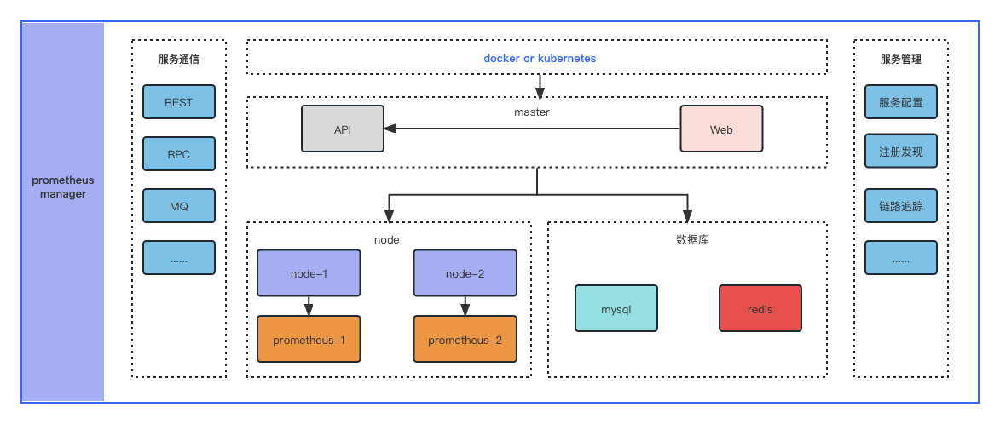
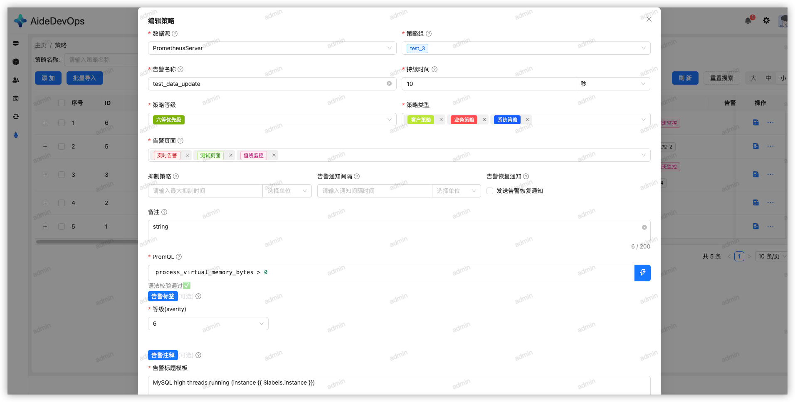
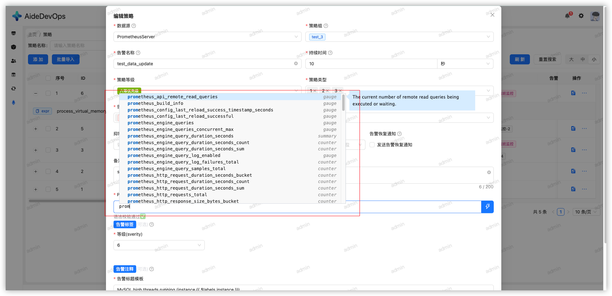
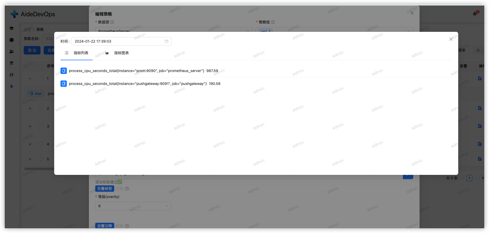
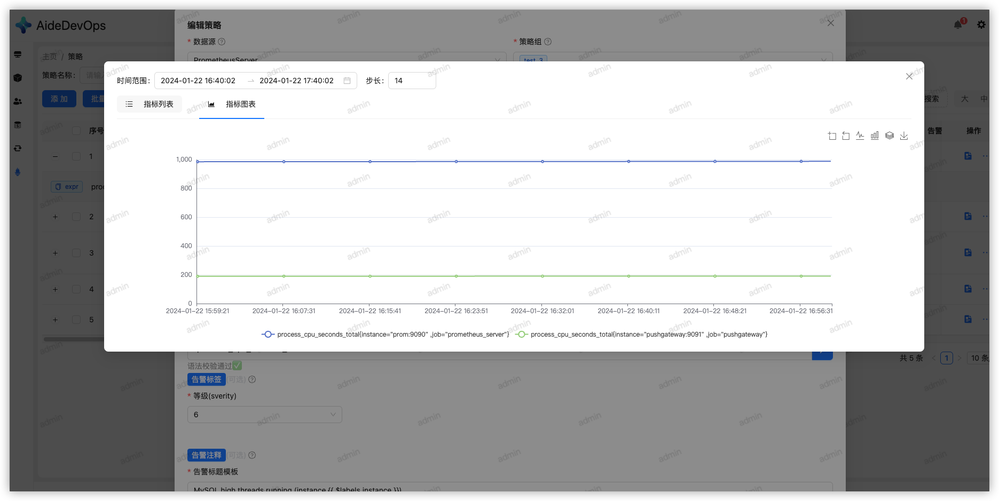
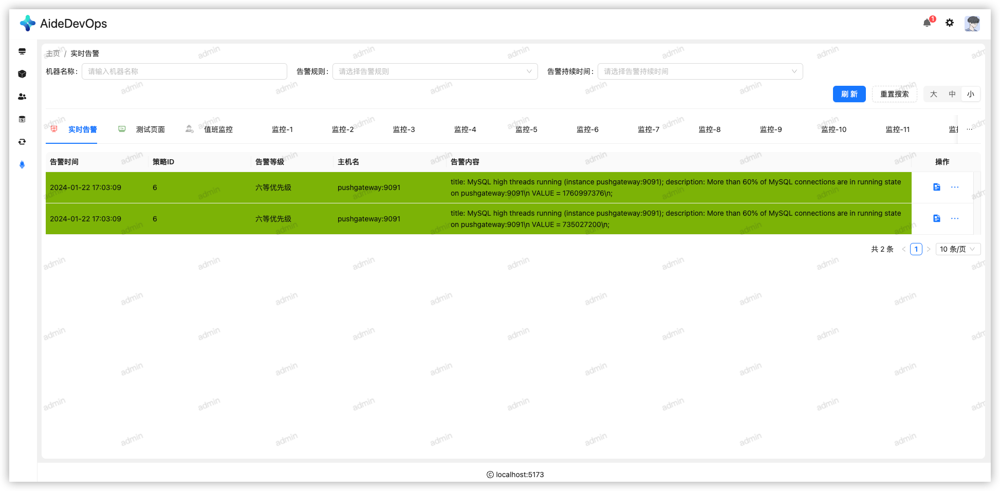
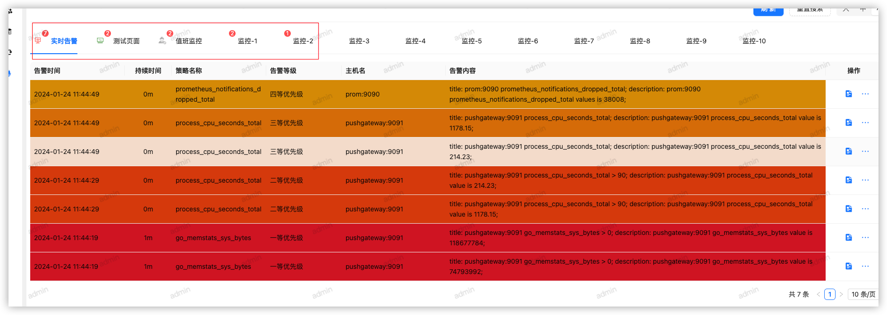
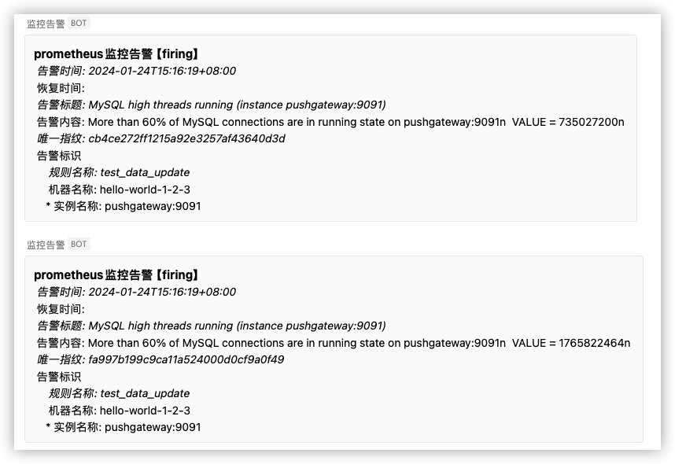

# Prometheus-manager

> prometheus 统一监控告警平台

<h1 style="display: flex; align-items: center; justify-content: center; gap: 10px; width: 100%; text-align: center;">
    
    
</h1>

## 系统介绍

1. 一款基于Prometheus的监控平台，支持多种告警策略，集成告警通知、告警历史、告警图表

## 项目简介

### PromServer 服务端

> 操作平台， 提供服务端接口，提供告警策略管理， 告警通知，告警历史，告警图表等服务

* 登录模块
* 系统模块
  * 用户管理
  * 角色管理
  * 权限管理
* 告警模块
  * 实时告警
  * 历史告警
  * 告警策略组
  * 告警策略
  * 数据源

### PromAgent 代理端

> 适配不同数据源，完成策略识别，生成告警/告警恢复事件

## 系统架构



## 开发

```bash
# 克隆代码
git clone https://github.com/aide-cloud/prometheus-manager.git

# 进入项目目录
cd prometheus-manager

# 安装依赖
make init

# 启动服务
# 服务端
make local app=app/prom_server
# 代理端
make local app=app/prom_agent
```

## 运行效果














## 告警通知

* 通知模板

```markdown
## prometheus监控告警【{{ $status }}】

* 告警时间: {{ $startsAt }}
* 恢复时间: {{ $endsAt }}
* 告警标题: {{ $annotations.title }}
* 告警内容: {{ $annotations.description }}
* 唯一指纹: {{ $fingerprint }}
* 告警标识
    * 规则名称: {{ $labels.alertname }}
    * 机器名称: {{ $labels.endpoint }}
    * 实例名称: {{ $labels.instance }}
```

* 通知示例



