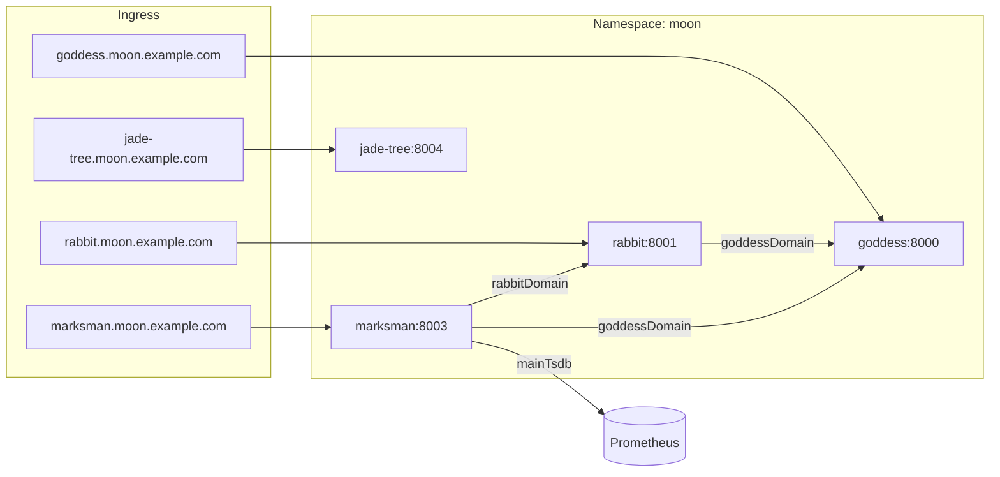

# Moon Kubernetes 部署指南

本目录包含 Moon 四个后端服务在 Kubernetes 上的部署清单，镜像由 GitHub Actions 自动构建并推送到 GHCR。

## 服务与镜像

| 服务 | 镜像 | HTTP | gRPC | 说明 |
|------|------|------|------|------|
| goddess（嫦娥） | `ghcr.io/aide-family/moon/goddess` | 8000 | 9000 | 认证授权 |
| rabbit（玉兔） | `ghcr.io/aide-family/moon/rabbit` | 8001 | 9001 | 消息通知；job 7001 |
| marksman（后羿） | `ghcr.io/aide-family/moon/marksman` | 8003 | 9003 | 事件告警 |
| jade_tree | `ghcr.io/aide-family/moon/jade_tree` | 8004 | 9004 | 机器信息采集 |

镜像在推送 `v*` tag 时自动构建，支持 `linux/amd64` 与 `linux/arm64` 多架构。详见 [`.github/workflows/docker-image.yml`](../../.github/workflows/docker-image.yml)。

## 目录结构

```
deploy/k8s/
├── README.md           # 本文档
├── namespace.yaml      # moon 命名空间
├── secrets.yaml        # JWT、service key 等敏感配置
├── goddess.yaml        # ConfigMap + PVC + Deployment + Service
├── rabbit.yaml
├── marksman.yaml
├── jade-tree.yaml
├── ingress.yaml        # HTTP 入口（nginx ingress）
└── kustomization.yaml  # Kustomize 入口，统一改镜像 tag
```

## 架构关系



集群内服务 DNS 示例：

- `goddess.moon.svc.cluster.local:8000`
- `rabbit.moon.svc.cluster.local:8001`
- `marksman.moon.svc.cluster.local:8003`
- `jade-tree.moon.svc.cluster.local:8004`

## 前置条件

- Kubernetes 1.24+
- `kubectl` 已配置并可访问目标集群
- 已安装 **Ingress Controller**（清单默认 `ingressClassName: nginx`，即 [ingress-nginx](https://kubernetes.github.io/ingress-nginx/)）
- 集群支持 **PersistentVolume**（默认 SQLite 使用 PVC 持久化）
- （可选）已部署 Prometheus，供 marksman 的 `mainTsdb` 使用
- （可选）GHCR 镜像为私有时，需配置 `imagePullSecrets`

## 快速部署

### 1. 修改配置

部署前至少修改以下内容。

**`secrets.yaml`** — 替换占位 secret：

```yaml
stringData:
  goddess-jwt-secret: <your-goddess-jwt>
  rabbit-jwt-secret: <your-rabbit-jwt>
  marksman-jwt-secret: <your-marksman-jwt>
  jade-tree-jwt-secret: <your-jade-tree-jwt>
  service-key-rabbit: sk-rabbit-dev      # 与 goddess allowedKeys、rabbit.goddessDomain.serviceKey 一致
  service-key-marksman: sk-marksman-dev  # 与 goddess allowedKeys、marksman 各 domain.serviceKey 一致
```

**`kustomization.yaml`** — 改为实际镜像 tag：

```yaml
images:
  - name: ghcr.io/aide-family/moon/goddess
    newTag: v0.0.3   # 与 GitHub tag 一致
```

**`ingress.yaml`** — 将 `*.moon.example.com` 改为你的域名，并按需启用 `tls` 段。

各服务 ConfigMap 中的 `server.yaml` 可按需调整（OAuth2、邮件、Prometheus 地址等），完整字段参考各 app 下的 `config/server.yaml`。

### 2. 预览并部署

```bash
# 在仓库根目录执行

# 预览渲染结果
kubectl kustomize deploy/k8s

# 一键部署
kubectl apply -k deploy/k8s
```

也可按文件逐个应用：

```bash
kubectl apply -f deploy/k8s/namespace.yaml
kubectl apply -f deploy/k8s/secrets.yaml
kubectl apply -f deploy/k8s/goddess.yaml
kubectl apply -f deploy/k8s/rabbit.yaml
kubectl apply -f deploy/k8s/marksman.yaml
kubectl apply -f deploy/k8s/jade-tree.yaml
kubectl apply -f deploy/k8s/ingress.yaml
```

### 3. 验证

```bash
# 查看 Pod
kubectl get pods -n moon

# 查看 Service
kubectl get svc -n moon

# 查看 Ingress
kubectl get ingress -n moon

# 健康检查（集群内）
kubectl run curl --rm -it --image=curlimages/curl -- \
  curl -s http://goddess.moon.svc.cluster.local:8000/health
```

对外访问需将 Ingress 域名解析到 Ingress Controller 的 External IP / LoadBalancer。

## 配置说明

### 配置加载方式

容器启动参数：

```text
<app> run all -c /etc/moon/config --log-level=INFO
```

- `-c /etc/moon/config`：从 ConfigMap 挂载的 `server.yaml` 读取配置
- 环境变量 `MOON_<APP>_*` 可覆盖 YAML 中的 `${MOON_*:default}` 占位符（见各 app 的 `config/server.yaml`）
- 敏感项（JWT、service key）通过 Secret 注入环境变量

### 默认存储

当前各服务默认使用 **SQLite**，数据文件挂载在 PVC `/data`：

| 服务 | DSN |
|------|-----|
| goddess | `file:/data/goddess.db?cache=shared` |
| rabbit | `file:/data/rabbit.db?cache=shared` |
| marksman | `file:/data/marksman.db?cache=shared` |
| jade_tree | `file:/data/jade_tree.db?cache=shared` |

**限制：** SQLite 仅适合单副本（`replicas: 1`）。生产环境多副本或高可用请改用 MySQL/Postgres，参考 `app/rabbit/config/server.yaml` 中注释的数据库配置块，并修改对应 ConfigMap。

数据库初始化 SQL 见：

- `app/rabbit/deploy/sql/`
- `app/goddess/cmd/schema/`
- `app/marksman/cmd/schema/`
- `app/jade_tree/cmd/schema/`

### Ingress 与 gRPC

- **Ingress** 仅暴露 HTTP API（8000/8001/8003/8004）
- **gRPC**（9000/9001/9003/9004）通过 ClusterIP 在集群内访问；若需集群外 gRPC，需额外配置 gRPC Ingress 或 Gateway API

### 健康检查

所有服务 HTTP 端口提供 `/health`（magicbox 标准健康检查），Deployment 已配置 liveness / readiness probe。

### Metrics

开启 `enableMetrics: true` 时，指标暴露在 HTTP 端口的 `/metrics` 路径，可由 Prometheus 抓取。

## 拉取私有镜像

若 GHCR 包为 private，先创建 pull secret：

```bash
kubectl create secret docker-registry ghcr-secret \
  -n moon \
  --docker-server=ghcr.io \
  --docker-username=<github-user> \
  --docker-password=<github-pat>
```

在各 Deployment 的 `spec.template.spec` 下增加：

```yaml
imagePullSecrets:
  - name: ghcr-secret
```

## 升级镜像

修改 `kustomization.yaml` 中的 `newTag` 后重新应用：

```bash
# 例如升级到 v0.0.3
kubectl apply -k deploy/k8s

# 观察滚动更新
kubectl rollout status deployment/goddess -n moon
kubectl rollout status deployment/rabbit -n moon
kubectl rollout status deployment/marksman -n moon
kubectl rollout status deployment/jade-tree -n moon
```

## 卸载

```bash
kubectl delete -k deploy/k8s
```

注意：删除 PVC 会丢失 SQLite 数据，请先备份。

## 常见问题

**Pod 一直 CrashLoopBackOff**

```bash
kubectl logs -n moon deployment/goddess
kubectl describe pod -n moon -l app.kubernetes.io/name=goddess
```

常见原因：Secret 未修改、PVC 未绑定、配置 YAML 格式错误。

**rabbit / marksman 调用 goddess 失败**

检查 `service-key-rabbit`、`service-key-marksman` 是否与 goddess ConfigMap 中 `serviceKey.allowedKeys` 一致。

**marksman 无法查询指标**

确认 `marksman-config` 中 `mainTsdb.url` 指向可访问的 Prometheus，默认 `http://prometheus.monitoring.svc.cluster.local:9090`，需自行部署或修改地址。

**Ingress 返回 404**

确认 DNS 已解析、Ingress Controller 正常运行、`ingressClassName: nginx` 与集群中 IngressClass 名称一致。

## 相关文档

- 镜像构建：`.github/workflows/docker-image.yml`
- 各服务默认配置：`app/<app>/config/server.yaml`
- Docker 构建：`app/<app>/Dockerfile`
