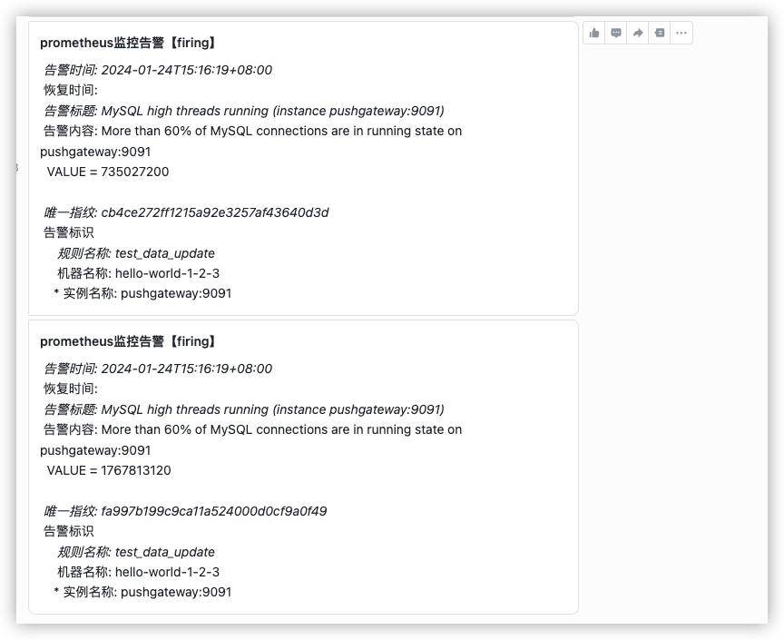
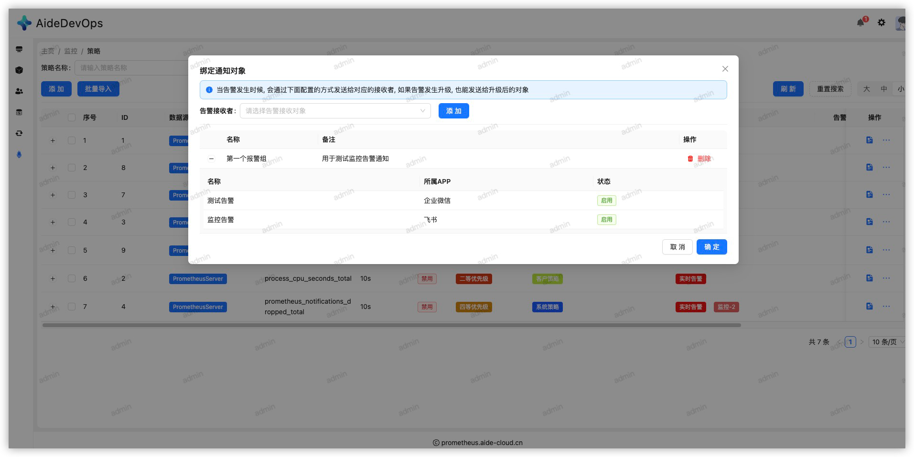
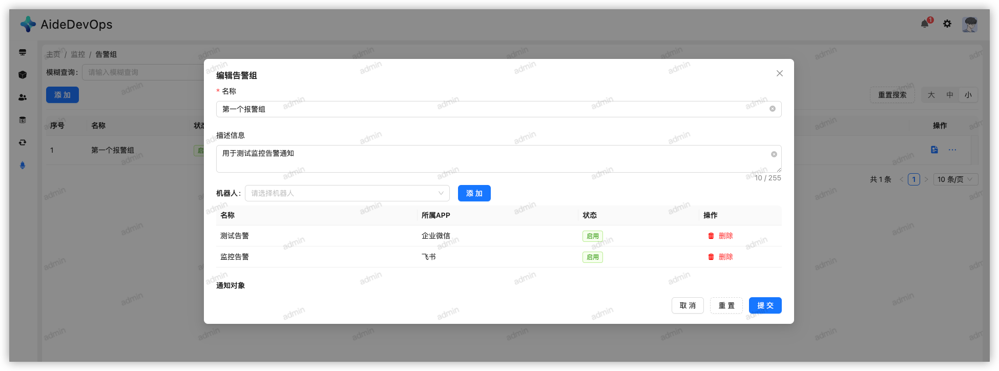
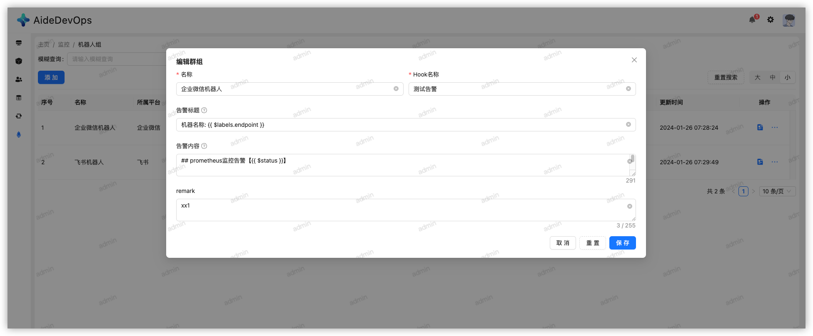

# Prometheus-manager

> prometheus 统一监控告警平台

<h1 style="display: flex; align-items: center; justify-content: center; gap: 10px; width: 100%; text-align: center;">
    
    
</h1>

## 系统介绍

1. 一款基于Prometheus的监控平台，支持多种告警策略，集成告警通知、告警历史、告警图表

* 体验demo
  > https://prometheus.aide-cloud.cn/
  > 
  > 账号：prometheus
  > 
  > 密码：123456

* [相关博文](https://juejin.cn/post/7329734768258760719) 

*  👉 [快速开始](../README.md)

## 项目简介

### PromServer 服务端

> 操作平台， 提供服务端接口，提供告警策略管理， 告警通知，告警历史，告警图表等服务

* 登录模块
* 系统模块
  * 用户管理
  * 角色管理
  * 权限管理
* 告警模块
  * 实时告警
    * 编辑规则时候可以关联报警页面， 当告警事件发生时候，会把此类告警展示到平台的制定页面，支持同一个告警展示到多个页面
  * 历史告警
    * 用于查看告警历史，作为复盘的数据支撑
  * 告警策略组
    * 对应prometheus告警的规则组，规则组下可以配置多个告警策略（规则）
  * 告警策略
    * 实际的报警规则管理功能， 在这里可以可视化编辑告警规则， 也能实时查看告警规则对应的数据图表，告警规则编辑过程中支持语法校验、智能提示等， 可以帮助我们更快更准确的配置告警
  * 数据源
    * 在实际生活中，我们可能面临有多个prom数据源的问题， 这里直接提供了数据源管理功能， 可以方便的添加、删除、修改数据源，然后在编辑规则过程中，对规则直接使用对应的数据源即可
  * hook管理
    * hook是告警通知的一种重要手段， 方便我们集成告警到其他系统，这里提供了常见的hook管理， 例如：钉钉、企业微信、飞书、第三方自定义hook等，hook本身还支持告警模板功能， 为我们定制告警内容提供了更加方便的姿势
  * 告警组管理
    * 用于把相同属性的一类通知对象进行分组， 然后在配置告警策略时候直接绑定告警组， 这样告警发生时候，能直接把告警信息发生给指定的通知对象了

### PromAgent 代理端

> 适配不同数据源，完成策略识别，生成告警/告警恢复事件

## 系统架构


## 开发

```bash
# 克隆代码
git clone https://github.com/aide-cloud/prometheus-manager.git

# 进入项目目录
cd prometheus-manager

# 安装依赖
make init

# 启动服务
# 服务端
make local app=app/prom_server
# 代理端
make local app=app/prom_agent
```

## 运行效果

* 策略列表


* 策略编辑


* 指标编辑


* 指标列表


* 指标列表


* 实时告警页面


* 实时告警统计


## 告警通知

* 通知模板

```markdown
## prometheus监控告警【{{ $status }}】

* 告警时间: {{ $startsAt }}
* 恢复时间: {{ $endsAt }}
* 告警标题: {{ $annotations.title }}
* 告警内容: {{ $annotations.description }}
* 唯一指纹: {{ $fingerprint }}
* 告警标识
    * 规则名称: {{ $labels.alertname }}
    * 机器名称: {{ $labels.endpoint }}
    * 实例名称: {{ $labels.instance }}
```

* 通知示例


* 飞书通知模板

```json
{
  "msg_type": "interactive",
  "card": {
    "elements": [
      {
        "tag": "div",
        "text": {
          "content": "* 告警时间: {{ $startsAt }}\n* 恢复时间: {{ $endsAt }}\n* 告警标题: {{ $annotations.title }}\n* 告警内容: {{ $annotations.description }}\n* 唯一指纹: {{ $fingerprint }}\n* 告警标识\n    * 规则名称: {{ $labels.alertname }}\n    * 机器名称: {{ $labels.endpoint }}\n    * 实例名称: {{ $labels.instance }}",
          "tag": "lark_md"
        }
      }
    ],
    "header": {
      "title": {
        "content": "prometheus监控告警【{{ $status }}】",
        "tag": "plain_text"
      }
    }
  }
}
```

* 飞书通知示例



* 策略绑定告警通知组



* 告警组管理



* hook机器人管理



* 数据源管理


