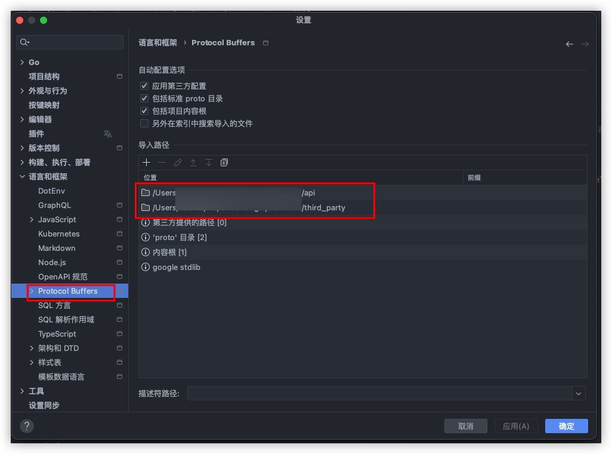
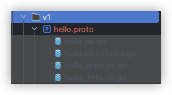

# 开发moon监控系统

## 写在前面

在开发前， 请确保你已经安装了go环境，以及protobuf、kratos框架相关依赖
如果没有， 请参考：[kratos项目初始化依赖安装](https://go-kratos.dev/docs/getting-started/start)

mac安装protoc插件
```bash
brew install protobuf
```

安装自定义errors生成插件, 此插件支持i18n

```bash
go install github.com/aide-cloud/protoc-gen-go-errors@latest
```

## api模块创建

对于公共的模型定义，可以写在api/global.proto中， 对于功能相关， 可以单独在api模块下新创建proto文件，创建命令如下

格式为： kratos proto add <目录>/文件名称.proto

例如，创建一个元数据管理的公共模型文件

```bash
 kratos proto add api/metadata.proto
```

创建完成的proto文件默认包含rpc CRUD方法，对于模型的proto文件，应该只包含message定义， 因此， 需要删除rpc定义， 重新定义自己的模型， 也就是message

对于需要依赖外部的proto部分，需要从third_party目录下引入，例如：

```protobuf
syntax = "proto3";

package api;

// 这里引入外部的proto文件
import "google/protobuf/duration.proto";
import "google/protobuf/any.proto";

option go_package = "github.com/aide-family/moon/api;api";
option java_multiple_files = true;
option java_package = "api";
```

在goland ied中，这样写会有代码报错的提示（其实没错）， 体验不是那么好，因此， 需要增加proto文件的依赖目录配置， 如下:



增加了third_party和api两个目录， 因为我们自己定义的api也需要能重复使用， 也要被内部的其他模块proto使用

对于api模块中rpc或者http请求方法的定义和模型proto定义略微不同， 创建命令还是同上，不过文件路径应在api下一级目录下， 这样便于模块和内部服务区分

例如， 现在我们创建一个SayHello的api

```bash
kratos proto add api/v1/hello.proto
```

执行上面命令， 创建出来的默认proto文件内容如下：

```protobuf
syntax = "proto3";

package api.v1;

// 这里的demo名称为项目module名称
option go_package = "demo/api/v1;v1";
option java_multiple_files = true;
option java_package = "api.v1";

service Hello {
	rpc CreateHello (CreateHelloRequest) returns (CreateHelloReply);
	rpc UpdateHello (UpdateHelloRequest) returns (UpdateHelloReply);
	rpc DeleteHello (DeleteHelloRequest) returns (DeleteHelloReply);
	rpc GetHello (GetHelloRequest) returns (GetHelloReply);
	rpc ListHello (ListHelloRequest) returns (ListHelloReply);
}

message CreateHelloRequest {}
message CreateHelloReply {}

message UpdateHelloRequest {}
message UpdateHelloReply {}

message DeleteHelloRequest {}
message DeleteHelloReply {}

message GetHelloRequest {}
message GetHelloReply {}

message ListHelloRequest {}
message ListHelloReply {}
```

我们需要增加http配置，以便我们生成出http和rpc对应的代码, 根据我们的需求， 修改完成的proto文件如下：

**注意⚠️**：proto字段采用小驼峰命名法，不允许使用下划线和小驼峰混用, 枚举类型（错误定义除外）采用大驼峰命名法，枚举名称作为前缀，不允许使用下划线， 枚举第一字段必须是UnKnown, 多个几件增加空行间隔， 注释内容不要携带字段本身，相关message之间不空行间隔， 不相关message之间空行间隔，内部字段之间不间隔

```protobuf
syntax = "proto3";

package api.v1;

// 导入http生成的代码
import "google/api/annotations.proto";

option go_package = "demo/api/v1;v1";
option java_multiple_files = true;
option java_package = "api.v1";

// Hello模块接口定义
service Hello {
	// 测试接口, 用于输出Hello
	rpc SayHello (SayHelloRequest) returns (SayHelloReply) {
		// 定义http路由
		option (google.api.http) = {
			post: "/v1/hello"
			body: "*"
		};
	}
}

// 定义请求参数
message SayHelloRequest {
	// 参数名称（对应请求方式，例如post请求，此数据会从body中获取）
	string name = 1;
}
// 定义响应参数
message SayHelloReply {
	// 参数名称， 这些参数会以json的方式返回给请求方
	string message = 1;
}
```

执行生成命令， 生成http和rpc对应的代码, make命令对应的具体命令可在根目录Makefile中查看

```bash
make api
```

执行完成后， 我们的对应目录下，就包含了对应的pb文件， 如下图所示：



基于这个Hello模块， 生成service业务代码, -t后面的路径为生成的目录， moon项目为多服务程序， 此目录应该对应到具体的服务

```bash
kratos proto server -t internal/service api/v1/hello.proto
```

例如 moon服务创建Hello

```bash
kratos proto server -t cmd/server/palace/internal/service/datasource api/admin/datasource/hello.proto
```

至此， api定义就完成了，结下来，我们需要去实现对应的Hello业务代码部分，主要包含依赖注入、biz（业务， 相当于mvc模式的service层）、repository（业务底层接口）、repoimpl（业务底层接口实现）部分

我们在demo服务去实现这些功能

创建service

```bash
kratos proto server -t cmd/server/demo/internal/service api/v1/hello.proto
```
定义repository

```go
// cmd/server/demo/internal/biz/repository/hello.go
package repository

import (
	"context"
)

// Hello .
type Hello interface {
	// SayHello .
	SayHello(ctx context.Context, name string) (string, error)
}
```

定义biz

```go
// cmd/server/demo/internal/biz/hello.go
package biz

import (
	"context"

	"github.com/aide-family/moon/cmd/server/demo/internal/biz/repository"
)

func NewHelloBiz(helloRepository repository.Hello) *HelloBiz {
	return &HelloBiz{
		helloRepository: helloRepository,
	}
}

// HelloBiz .
type HelloBiz struct {
	helloRepository repository.Hello
}

func (b *HelloBiz) SayHello(ctx context.Context, name string) (string, error) {
	return b.helloRepository.SayHello(ctx, name)
}

```

# 注入biz

```go
// cmd/server/demo/internal/biz/biz.go
package biz

import "github.com/google/wire"

// ProviderSetBiz is biz providers.
var ProviderSetBiz = wire.NewSet(
	NewGreeterUsecase,
	NewHelloBiz,
)
```

# 在service中使用HelloBiz

```go
// cmd/server/demo/internal/service/hello.go
package service

import (
	"context"

	pb "github.com/aide-family/moon/api/v1"
	"github.com/aide-family/moon/cmd/server/demo/internal/biz"
)

type HelloService struct {
	pb.UnimplementedHelloServer

	helloBiz *biz.HelloBiz
}

func NewHelloService(helloBiz *biz.HelloBiz) *HelloService {
	return &HelloService{
		helloBiz: helloBiz,
	}
}

func (s *HelloService) SayHello(ctx context.Context, req *pb.SayHelloRequest) (*pb.SayHelloReply, error) {
	hello, err := s.helloBiz.SayHello(ctx, req.GetName())
	if err != nil {
		return nil, err
	}
	return &pb.SayHelloReply{
		Message: hello,
	}, nil
}

```

# 注入service

```go
// cmd/server/demo/internal/service/service.go
package service

import (
	"github.com/google/wire"
)

// ProviderSetService is service providers.
var ProviderSetService = wire.NewSet(
	NewGreeterService,
	NewHelloService,
)
```

# 在服务里面去注册此功能

```go
package server

import (
	v1 "github.com/aide-family/moon/api/helloworld/v1"
	v1api "github.com/aide-family/moon/api/v1"
	"github.com/aide-family/moon/cmd/server/demo/internal/service"

	"github.com/go-kratos/kratos/v2/transport"
	"github.com/go-kratos/kratos/v2/transport/grpc"
	"github.com/go-kratos/kratos/v2/transport/http"
	"github.com/google/wire"
)

// ProviderSetServer is server providers.
var ProviderSetServer = wire.NewSet(NewGRPCServer, NewHTTPServer, RegisterService)

type Server struct {
	rpcSrv  *grpc.Server
	httpSrv *http.Server
}

// GetRpcServer 获取rpc server
func (s *Server) GetRpcServer() *grpc.Server {
	return s.rpcSrv
}

// GetHttpServer 获取http server
func (s *Server) GetHttpServer() *http.Server {
	return s.httpSrv
}

// GetServers 注册服务
func (s *Server) GetServers() []transport.Server {
	return []transport.Server{
		s.rpcSrv,
		s.httpSrv,
	}
}

func RegisterService(
	rpcSrv *grpc.Server,
	httpSrv *http.Server,
	greeter *service.GreeterService,
	// 注册hello
	helloService *service.HelloService,
) *Server {
	// 注册GRPC服务
	v1.RegisterGreeterServer(rpcSrv, greeter)
	v1api.RegisterHelloServer(rpcSrv, helloService)

	// 注册HTTP服务
	v1.RegisterGreeterHTTPServer(httpSrv, greeter)
	v1api.RegisterHelloHTTPServer(httpSrv, helloService)

	return &Server{
		rpcSrv:  rpcSrv,
		httpSrv: httpSrv,
	}
}
```

# 实现hello的repository

```go
package repoimpl

import (
	"context"

	"github.com/aide-family/moon/cmd/server/demo/internal/biz/repository"
	"github.com/aide-family/moon/cmd/server/demo/internal/data"
)

func NewHelloRepository(data *data.Data) repository.Hello {
	return &helloRepositoryImpl{data: data}
}

type helloRepositoryImpl struct {
	data *data.Data
}

func (h *helloRepositoryImpl) SayHello(ctx context.Context, name string) (string, error) {
	return "hello " + name, nil
}
```

# 注入repository 实现

```go
package repoimpl

import (
	"github.com/google/wire"
)

var ProviderSetRepoImpl = wire.NewSet(
	NewCacheRepo,
	NewHelloRepository,
)
```

至此，一个hello的功能就开发完了， 现在我们需要来生成注入后的代码， 执行如下命令

```bash
make wire
```

# 运行项目

```bash
go run cmd/server/demo/demo/cmd.go -c cmd/server/demo/configs
```

接下来预祝你开发一切顺利
