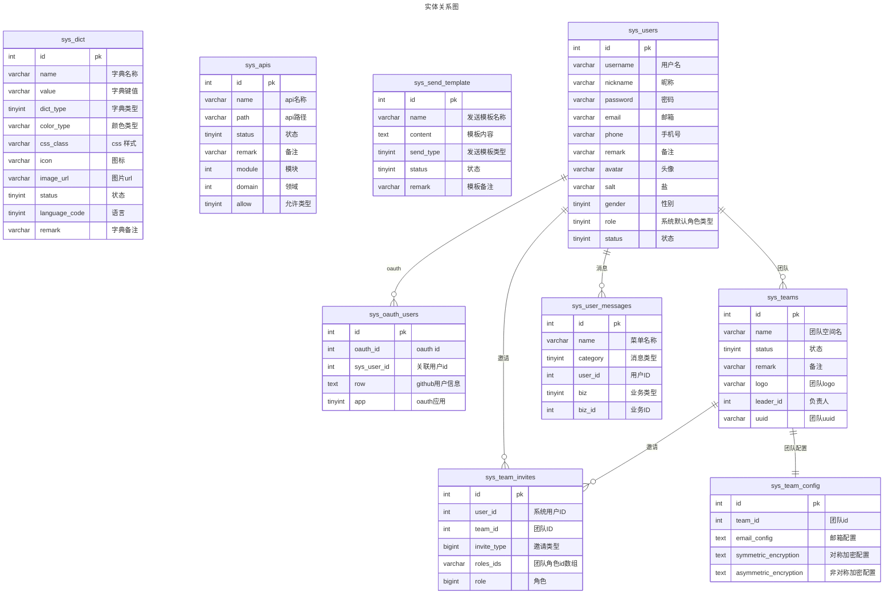

# 实体关系图

```mermaid
---
title: 实体关系图
---
erDiagram
    sys_dict {
        int id pk
        varchar name "字典名称"
        varchar value "字典键值"
        tinyint dict_type "字典类型"
        varchar color_type "颜色类型"
        varchar css_class "css 样式"
        varchar icon "图标"
        varchar image_url "图片url"
        tinyint status "状态"
        tinyint language_code "语言"
        varchar remark "字典备注"
    }

    sys_apis {
        int id pk
        varchar name "api名称"
        varchar path "api路径"
        tinyint status "状态"
        varchar remark "备注"
        int module "模块"
        int domain "领域"
        tinyint allow "允许类型"
    }

    sys_oauth_users {
        int id pk
        int oauth_id "oauth id"
        int sys_user_id "关联用户id"
        text row "github用户信息"
        tinyint app "oauth应用"
    }

    sys_send_template {
        int id pk
        varchar name "发送模板名称"
        text content "模板内容"
        tinyint send_type "发送模板类型"
        tinyint status "状态"
        varchar remark "模板备注"
    }

    sys_team_config {
        int id pk
        int team_id "团队id"
        text email_config "邮箱配置"
        text symmetric_encryption "对称加密配置"
        text asymmetric_encryption "非对称加密配置"
    }

    sys_team_invites {
        int id pk
        int user_id "系统用户ID"
        int team_id "团队ID"
        bigint invite_type "邀请类型"
        varchar roles_ids "团队角色id数组"
        bigint role "角色"
    }

    sys_teams {
        int id pk
        varchar name "团队空间名"
        tinyint status "状态"
        varchar remark "备注"
        varchar logo "团队logo"
        int leader_id "负责人"
        varchar uuid "团队uuid"
    }

    sys_user_messages {
        int id pk
        varchar name "菜单名称"
        tinyint category "消息类型"
        int user_id "用户ID"
        tinyint biz "业务类型"
        int biz_id "业务ID"
    }

    sys_users {
        int id pk
        varchar username "用户名"
        varchar nickname "昵称"
        varchar password "密码"
        varchar email "邮箱"
        varchar phone "手机号"
        varchar remark "备注"
        varchar avatar "头像"
        varchar salt "盐"
        tinyint gender "性别"
        tinyint role "系统默认角色类型"
        tinyint status "状态"
    }

    sys_users ||--o{ sys_team_invites : "邀请"
    sys_users ||--o{ sys_user_messages : "消息"
    sys_users ||--o{ sys_teams : "团队"
    sys_users ||--o{ sys_oauth_users : "oauth"
    sys_teams ||--|| sys_team_config : "团队配置"
    sys_teams ||--o{ sys_team_invites : "邀请"
```
