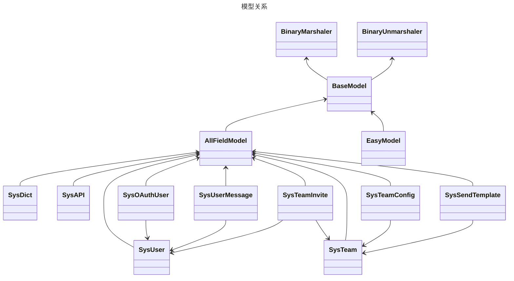

# 模型关系

```mermaid
---
title: 模型关系
---

classDiagram
    BinaryMarshaler <-- BaseModel
    BinaryUnmarshaler <-- BaseModel
    BaseModel <-- AllFieldModel
    BaseModel <-- EasyModel

    AllFieldModel <-- SysDict
    AllFieldModel <-- SysAPI
    AllFieldModel <-- SysOAuthUser
    AllFieldModel <-- SysUser
   
    AllFieldModel <-- SysTeamInvite
    AllFieldModel <-- SysTeamConfig
    AllFieldModel <-- SysSendTemplate
    AllFieldModel <-- SysUserMessage

    SysOAuthUser --> SysUser

    SysUserMessage --> SysUser

    SysTeamInvite --> SysTeam
    SysTeamInvite --> SysUser

    AllFieldModel <-- SysTeam

    SysTeamConfig --> SysTeam

    SysSendTemplate --> SysTeam
```
