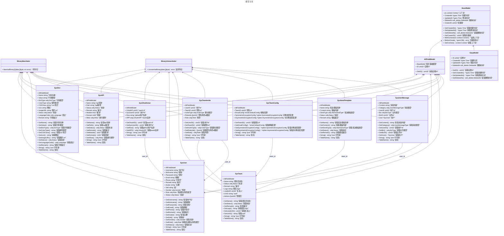

# 模型关系

```mermaid
---
title: 模型关系
---

classDiagram
    class BinaryMarshaler {
        + MarshalBinary() (data []byte, err error) "序列化"
    }

    class BinaryUnmarshaler {
        + UnmarshalBinary(data []byte) error "反序列化"
    }

    class BaseModel {
        - ctx context.Context "上下文"

        + CreatedAt *types.Time "创建时间"
        + UpdatedAt *types.Time "更新时间"
        + DeletedAt soft_delete.DeletedAt "删除时间"
        + CreatorID uint32 "创建者"

        + GetCreatedAt() *types.Time "获取创建时间"
        + GetUpdatedAt() *types.Time "获取更新时间"
        + GetDeletedAt() soft_delete.DeletedAt "获取删除时间"
        + GetCreatorID() uint32 "获取创建者"

        + WithContext(ctx context.Context) "设置上下文"
        + BeforeCreate(_ *gorm.DB) error "创建前钩子"
        + GetContext() context.Context "获取上下文"
    }

    class AllFieldModel {
        + BaseModel "组合基础模型"
        + ID uint32 "自增ID"

        + GetID() uint32 "获取自增ID"
    }

    class EasyModel {
        + ID uint32 "自增ID"
        + CreatedAt *types.Time "创建时间"
        + UpdatedAt *types.Time "更新时间"
        + DeletedAt soft_delete.DeletedAt "删除时间"

        + GetID() uint32 "获取自增ID"
        + GetCreatedAt() *types.Time "获取创建时间"
        + GetUpdatedAt() *types.Time "获取更新时间"
        + GetDeletedAt() soft_delete.DeletedAt "获取删除时间"
    }

    class SysDict {
        + AllFieldModel
        + Name string "字典名称"
        + Value string "字典键值"
        + DictType vobj.DictType "字典类型"
        + ColorType string "颜色类型"
        + CSSClass string "css 样式"
        + Icon string "图标"
        + ImageURL string "图片url"
        + Status vobj.Status "状态"
        + LanguageCode vobj.Language "语言"
        + Remark string "字典备注"

        + GetName() string "获取字典名称"
        + GetValue() string "获取字典键值"
        + GetDictType() vobj.DictType "获取字典类型"
        + GetColorType() string "获取颜色类型"
        + GetCSSClass() string "获取css 样式"
        + GetIcon() string "获取图标"
        + GetImageURL() string "获取图片url"
        + GetStatus() vobj.Status "获取状态"
        + GetLanguageCode() vobj.Language "获取语言"
        + GetRemark() string "获取字典备注"
        + String() string "json 字符串"
        + TableName() string "表名"
    }

    class SysAPI {
        + AllFieldModel
        + Name string "api名称"
        + Path string "api路径"
        + Status vobj.Status "状态"
        + Remark string "备注"
        + Module int32 "模块"
        + Domain int32 "领域"
        + Allow vobj.Allow "放行规则"

        + GetName() string "获取api名称"
        + GetPath() string "获取api路径"
        + GetStatus() vobj.Status "获取状态"
        + GetRemark() string "获取备注"
        + GetModule() int32 "获取模块"
        + GetDomain() int32 "获取领域"
        + GetAllow() vobj.Allow "获取放行规则"
        + String() string "json 字符串"
        + TableName() string "表名"
    }

    class SysOAuthUser {
        + AllFieldModel
        + OAuthID uint32 "oauth id"
        + SysUserID uint32 "用户id"
        + Row string "github用户信息"
        + APP vobj.OAuthAPP "oauth应用"

        + GetOAuthID() uint32 "获取oauth id"
        + GetSysUserID() uint32 "获取用户id"
        + GetRow() string "获取github用户信息"
        + GetAPP() vobj.OAuthAPP "获取oauth应用"
        + String() string "json 字符串"
        + TableName() string "表名"
    }

    class SysUser {
        + AllFieldModel
        + Username string "用户名"
        + Nickname string "昵称"
        + Password string "密码"
        + Email string "邮箱"
        + Phone string "手机号"
        + Remark string "备注"
        + Avatar string "头像"
        + Salt string "盐"
        + Gender vobj.Gender "性别"
        + Role vobj.Role "系统默认角色类型"
        + Status vobj.Status "状态"

        + GetUsername() string "获取用户名"
        + GetNickname() string "获取昵称"
        + GetPassword() string "获取密码"
        + GetEmail() string "获取邮箱"
        + GetPhone() string "获取手机号"
        + GetRemark() string "获取备注"
        + GetAvatar() string "获取头像"
        + GetSalt() string "获取盐"
        + GetGender() vobj.Gender "获取性别"
        + GetRole() vobj.Role "获取系统默认角色类型"
        + GetStatus() vobj.Status "获取状态"
        + String() string "json 字符串"
        + TableName() string "表名"
    }

    class SysTeam {
        + AllFieldModel
        + Name string "团队空间名"
        + Status vobj.Status "状态"
        + Remark string "备注"
        + Logo string "团队logo"
        + LeaderID uint32 "负责人"
        + UUID string "uuid"
        + Admins []uint32 "管理员"

        + GetName() string "获取团队空间名"
        + GetStatus() vobj.Status "获取状态"
        + GetRemark() string "获取备注"
        + GetLogo() string "获取团队logo"
        + GetLeaderID() uint32 "获取负责人"
        + GetUUID() string "获取uuid"
        + String() string "json 字符串"
        + TableName() string "表名"
    }

    class SysTeamInvite {
        + AllFieldModel
        + UserID uint32 "用户id"
        + TeamID uint32 "团队id"
        + InviteType vobj.InviteType "邀请类型"
        + RolesIds []uint32 "团队角色id数组"
        + Role vobj.Role "角色"

        + GetUserID() uint32 "获取用户id"
        + GetTeamID() uint32 "获取团队id"
        + GetInviteType() vobj.InviteType "获取邀请类型"
        + GetRolesIds() []uint32 "获取团队角色id数组"
        + GetRole() vobj.Role "获取角色"
        + String() string "json 字符串"
        + TableName() string "表名"
    }

    class SysTeamConfig {
        + AllFieldModel
        + TeamID uint32 "团队id"
        + EmailConfig *email.DefaultConfig "邮箱配置"
        + SymmetricEncryptionConfig *cipher.SymmetricEncryptionConfig "对称加密配置"
        + AsymmetricEncryptionConfig *cipher.AsymmetricEncryptionConfig "非对称加密配置"

        + GetTeamID() uint32 "获取团队id"
        + GetEmailConfig() *email.DefaultConfig "获取邮箱配置"
        + GetSymmetricEncryptionConfig() *cipher.SymmetricEncryptionConfig "获取对称加密配置"
        + GetAsymmetricEncryptionConfig() *cipher.AsymmetricEncryptionConfig "获取非对称加密配置"
        + String() string "json 字符串"
        + TableName() string "表名"
    }

    class SysSendTemplate {
        + AllFieldModel
        + Name string "发送模板名称"
        + Content string "模板内容"
        + SendType vobj.AlarmSendType "发送模板类型"
        + Status vobj.Status "状态"
        + Remark string "模板备注"

        + GetName() string "获取发送模板名称"
        + GetContent() string "获取模板内容"
        + GetSendType() vobj.AlarmSendType "获取发送模板类型"
        + GetStatus() vobj.Status "获取状态"
        + GetRemark() string "获取模板备注"
        + String() string "json 字符串"
        + TableName() string "表名"
    }

    class SysUserMessage {
        + AllFieldModel
        + Content string "消息内容"
        + Category vobj.UserMessageType "消息类型"
        + UserID uint32 "用户id"
        + Biz vobj.BizType "业务类型"
        + BizID uint32 "业务id"
        + User *SysUser "用户"

        + GetContent() string "获取消息内容"
        + GetCategory() vobj.UserMessageType "获取消息类型"
        + GetUserID() uint32 "获取用户id"
        + GetBiz() vobj.BizType "获取业务类型"
        + GetBizID() uint32 "获取业务id"
        + GetUser() *SysUser "获取用户"
        + String() string "json 字符串"
        + TableName() string "表名"
    }

    BaseModel <-- AllFieldModel
    BaseModel <-- EasyModel

    BinaryMarshaler <-- SysDict
    BinaryUnmarshaler <-- SysDict
    AllFieldModel <-- SysDict

    BinaryMarshaler <-- SysAPI
    BinaryUnmarshaler <-- SysAPI
    AllFieldModel <-- SysAPI

    BinaryMarshaler <-- SysOAuthUser
    BinaryUnmarshaler <-- SysOAuthUser
    AllFieldModel <-- SysOAuthUser

    BinaryMarshaler <-- SysUser
    BinaryUnmarshaler <-- SysUser
    AllFieldModel <-- SysUser

    SysOAuthUser --> SysUser : user_id

    BinaryMarshaler <-- SysTeam
    BinaryUnmarshaler <-- SysTeam
    AllFieldModel <-- SysTeam

    SysTeamInvite --> SysTeam : team_id
    SysTeamInvite --> SysUser : user_id

    BinaryMarshaler <-- SysTeamInvite
    BinaryUnmarshaler <-- SysTeamInvite
    AllFieldModel <-- SysTeamInvite

    BinaryMarshaler <-- SysTeamConfig
    BinaryUnmarshaler <-- SysTeamConfig
    AllFieldModel <-- SysTeamConfig

    SysTeamConfig --> SysTeam : team_id

    BinaryMarshaler <-- SysSendTemplate
    BinaryUnmarshaler <-- SysSendTemplate
    AllFieldModel <-- SysSendTemplate

    SysSendTemplate --> SysTeam : team_id

    BinaryMarshaler <-- SysUserMessage
    BinaryUnmarshaler <-- SysUserMessage
    AllFieldModel <-- SysUserMessage

    SysUserMessage --> SysUser : user_id

```
