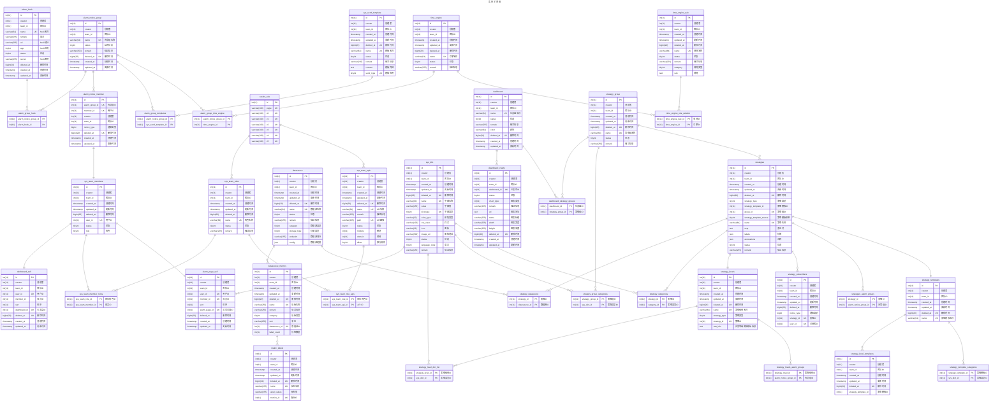

# 实体关系图

```mermaid
---
title: 实体关系图
---
erDiagram
    alarm_group_hook {
        int(11) alarm_notice_group_id PK
        int(11) alarm_hook_id PK
    }

    alarm_group_templates {
        int(11) alarm_notice_group_id PK
        int(11) sys_send_template_id PK
    }

    alarm_group_time_engine {
        int(11) alarm_notice_group_id PK
        int(11) time_engine_id PK
    }

    alarm_hook {
        int(11) id PK
        int(11) creator "创建者"
        int(11) team_id "团队ID"
        varchar(64) name UK "hook名称"
        varchar(255) remark "备注"
        varchar(255) url "hook地址"
        tinyint app "hook应用"
        tinyint status "状态"
        varchar(255) secret "hook密钥"
        bigint(20) deleted_at "删除时间"
        timestamp created_at "创建时间"
        timestamp updated_at "更新时间"
    }

    alarm_notice_group {
        int(11) id PK
        int(11) creator "创建者"
        int(11) team_id "团队ID"
        varchar(64) name UK "告警组名称"
        tinyint status "启用状态"
        varchar(255) remark "描述信息"
        bigint(20) deleted_at UK "删除时间"
        timestamp created_at "创建时间"
        timestamp updated_at "更新时间"
    }

    alarm_notice_member {
        int(11) id PK
        int(11) alarm_group_id UK "告警组ID"
        int(11) member_id UK "用户ID"
        int(11) creator "创建者"
        int(11) team_id "团队ID"
        bigint notice_type "通知类型"
        bigint(20) deleted_at UK "删除时间"
        timestamp created_at "创建时间"
        timestamp updated_at "更新时间"
    }

    alarm_page_self {
        int(11) id PK
        int(11) creator "创建者"
        int(11) team_id "团队ID"
        int(11) user_id UK "用户ID"
        int(11) member_id UK "成员ID"
        int(11) sort "排序"
        int(11) alarm_page_id UK "报警页面ID"
        bigint(20) deleted_at "删除时间"
        timestamp created_at "创建时间"
        timestamp updated_at "更新时间"
    }

    casbin_rule {
        int(11) id PK
        varchar(100) ptype UK
        varchar(100) v0 UK
        varchar(100) v1 UK
        varchar(100) v2 UK
        varchar(100) v3 UK
        varchar(100) v4 UK
        varchar(100) v5 UK
    }

    dashboard {
        int(11) id PK
        int(11) creator "创建者"
        int(11) team_id "团队ID"
        varchar(64) name UK "仪表盘名称"
        tinyint status "状态"
        varchar(255) remark "描述信息"
        varchar(64) color "颜色"
        bigint(20) deleted_at UK "删除时间"
        timestamp created_at "创建时间"
        timestamp updated_at "更新时间"
    }

    dashboard_charts {
        int(11) id PK
        int(11) creator "创建者"
        int(11) team_id "团队ID"
        int(11) dashboard_id UK "仪表盘ID"
        tinyint status "状态"
        int(11) chart_type "图表类型"
        varchar(255) remark "描述信息"
        text url "图表地址"
        varchar(255) name "图表标题"
        varchar(255) width "图表宽度"
        varchar(255) height "图表高度"
        bigint(20) deleted_at UK "删除时间"
        timestamp created_at "创建时间"
        timestamp updated_at "更新时间"
    }

    dashboard_self {
        int(11) id PK
        int(11) creator "创建者"
        int(11) team_id "团队ID"
        int(11) user_id UK "用户ID"
        int(11) member_id "成员ID"
        int(11) sort "排序"
        int(11) dashboard_id UK "仪表盘ID"
        bigint(20) deleted_at UK "删除时间"
        timestamp created_at "创建时间"
        timestamp updated_at "更新时间"
    }

    dashboard_strategy_groups {
        int(11) dashboard_id PK "仪表盘ID"
        int(11) strategy_group_id PK "策略组ID"
    }

    datasource {
        int(11) id PK
        int(11) creator "创建者"
        int(11) team_id "团队ID"
        timestamp created_at "创建时间"
        timestamp updated_at "更新时间"
        bigint(20) deleted_at UK "删除时间"
        varchar(64) name UK "数据源名称"
        tinyint status "状态"
        varchar(255) remark "描述信息"
        tinyint category "数据源类型"
        tinyint storage_type "存储类型"
        varchar(255) endpoint "数据源地址"
        json config "数据源配置"
    }

    datasource_metrics {
        int(11) id PK
        int(11) creator "创建者"
        int(11) team_id "团队ID"
        timestamp created_at "创建时间"
        timestamp updated_at "更新时间"
        bigint(20) deleted_at UK "删除时间"
        varchar(255) name UK "指标名称"
        varchar(255) remark "描述信息"
        tinyint category "指标类型"
        varchar(255) unit "单位"
        int(11) datasource_id UK "数据源ID"
        int(11) label_count "标签数量"
    }

    metric_labels {
        int(11) id PK
        int(11) creator "创建者"
        int(11) team_id "团队ID"
        timestamp created_at "创建时间"
        timestamp updated_at "更新时间"
        bigint(20) deleted_at UK "删除时间"
        varchar(255) name UK "标签名称"
        varchar(255) label_values "标签值"
        int(11) metrics_id UK "指标ID"
    }

    strategies {
        int(11) id PK
        int(11) creator "创建者"
        int(11) team_id "团队ID"
        timestamp created_at "创建时间"
        timestamp updated_at "更新时间"
        bigint(20) deleted_at UK "删除时间"
        tinyint strategy_type "策略类型"
        int(11) strategy_template_id "策略模板ID"
        int(11) group_id UK "策略组ID"
        tinyint strategy_template_source "策略模板来源"
        varchar(64) name UK "策略名称"
        text expr "表达式"
        json labels "标签"
        json annotations "注释"
        tinyint status "状态"
        varchar(255) remark "描述信息"
    }

    strategies_alarm_groups {
        int(11) strategy_id PK "策略ID"
        int(11) alarm_notice_group_id PK "告警组ID"
    }

    strategy_categories {
        int(11) strategy_id PK "策略ID"
        int(11) category_id PK "策略类型ID"
    }

    strategy_datasource {
        int(11) strategy_id PK "策略ID"
        int(11) datasource_id PK "数据源ID"
    }

    strategy_group {
        int(11) id PK
        int(11) creator "创建者"
        int(11) team_id "团队ID"
        timestamp created_at "创建时间"
        timestamp updated_at "更新时间"
        bigint(20) deleted_at UK "删除时间"
        varchar(64) name UK "策略组名称"
        tinyint status "状态"
        varchar(255) remark "描述信息"
    }

    strategy_group_categories {
        int(11) strategy_group_id PK "策略组ID"
        int(11) sys_dict_id PK "策略类型ID"
    }

    strategy_level_dict_list {
        int(11) strategy_level_id PK "策略级别ID"
        int(11) sys_dict_id PK "策略类型ID"
    }

    strategy_level_templates {
        int(11) id PK
        int(11) creator "创建者"
        int(11) team_id "团队ID"
        timestamp created_at "创建时间"
        timestamp updated_at "更新时间"
        bigint(20) deleted_at UK "删除时间"
        int(11) strategy_template_id "策略模板ID"
    }

    strategy_levels {
        int(11) id PK
        int(11) creator "创建者"
        int(11) team_id "团队ID"
        timestamp created_at "创建时间"
        timestamp updated_at "更新时间"
        bigint(20) deleted_at UK "删除时间"
        varchar(64) name UK "策略级别名称"
        tinyint strategy_type "策略类型"
        int(11) strategy_id UK "策略ID"
        text raw_info "告警等级明细原始信息"
    }

    strategy_levels_alarm_groups {
        int(11) strategy_level_id PK "策略级别ID"
        int(11) alarm_notice_group_id PK "告警组ID"
    }

    strategy_subscribers {
        int(11) id PK
        int(11) creator "创建者"
        int(11) team_id "团队ID"
        timestamp created_at "创建时间"
        timestamp updated_at "更新时间"
        bigint(20) deleted_at "删除时间"
        bigint notice_type "通知类型"
        int(11) strategy_id UK "策略ID"
        int(11) user_id UK "订阅者ID"
    }

    strategy_template_categories {
        int(11) strategy_template_id PK "策略模板ID"
        int(11) sys_dict_id PK "策略类型ID"
    }

    strategy_templates {
        int(11) id PK
        int(11) creator "创建者"
        int(11) team_id "团队ID"
        timestamp created_at "创建时间"
        timestamp updated_at "更新时间"
        bigint(20) deleted_at UK "删除时间"
        varchar(64) name UK "策略模板名称"
    }

    sys_dict {
        int(11) id PK
        int(11) creator "创建者"
        int(11) team_id "团队ID"
        timestamp created_at "创建时间"
        timestamp updated_at "更新时间"
        bigint(20) deleted_at UK "删除时间"
        varchar(64) name UK "字典名称"
        varchar(255) value "字典值"
        tinyint dict_type UK "字典类型"
        varchar(32) color_type "颜色类型"
        varchar(100) css_class "样式"
        varchar(32) icon "图标"
        varchar(500) image_url "图标地址"
        tinyint status "状态"
        tinyint language_code "语言"
        varchar(255) remark "描述信息"
    }

    sys_send_template {
        int(11) id PK
        int(11) creator "创建者"
        int(11) team_id "团队ID"
        timestamp created_at "创建时间"
        timestamp updated_at "更新时间"
        bigint(20) deleted_at UK "删除时间"
        varchar(64) name UK "模板名称"
        tinyint status "状态"
        varchar(255) remark "描述信息"
        text content "模板内容"
        tinyint send_type UK "模板应用"
    }

    sys_team_apis {
        int(11) id PK
        int(11) creator "创建者"
        int(11) team_id "团队ID"
        timestamp created_at "创建时间"
        timestamp updated_at "更新时间"
        bigint(20) deleted_at UK "删除时间"
        varchar(64) name UK "API名称"
        varchar(255) remark "描述信息"
        varchar(255) path UK "API路径"
        tinyint status "状态"
        int(11) module "模块"
        int(11) domain "领域"
        tinyint allow "放行规则"
    }

    sys_team_member_roles {
        int(11) sys_team_role_id PK "团队角色ID"
        int(11) sys_team_member_id PK "成员ID"
    }

    sys_team_members {
        int(11) id PK
        int(11) creator "创建者"
        int(11) team_id "团队ID"
        timestamp created_at "创建时间"
        timestamp updated_at "更新时间"
        bigint(20) deleted_at "删除时间"
        int(11) user_id UK "用户ID"
        tinyint status "状态"
        tinyint role "角色"
    }

    sys_team_role_apis {
        int(11) sys_team_role_id PK "团队角色ID"
        int(11) sys_team_api_id PK "API ID"
    }

    sys_team_roles {
        int(11) id PK
        int(11) creator "创建者"
        int(11) team_id "团队ID"
        timestamp created_at "创建时间"
        timestamp updated_at "更新时间"
        bigint(20) deleted_at "删除时间"
        varchar(64) name UK "角色名称"
        tinyint status "状态"
        varchar(255) remark "描述信息"
    }

    time_engine {
        int(11) id PK
        int(11) creator "创建者"
        int(11) team_id "团队ID"
        timestamp created_at "创建时间"
        timestamp updated_at "更新时间"
        bigint(20) deleted_at "删除时间"
        varchar(64) name UK "引擎名称"
        tinyint status "状态"
        varchar(255) remark "描述信息"
    }

    time_engine_rule {
        int(11) id PK
        int(11) creator "创建者"
        int(11) team_id "团队ID"
        timestamp created_at "创建时间"
        timestamp updated_at "更新时间"
        bigint(20) deleted_at "删除时间"
        varchar(64) name UK "规则名称"
        tinyint status "状态"
        varchar(255) remark "描述信息"
        tinyint category "规则类型"
        text rule "规则"
    }

    time_engine_rule_relation {
        int(11) time_engine_rule_id PK "规则ID"
        int(11) time_engine_id PK "引擎ID"
    }

    sys_team_members ||--|| dashboard_self : ""
    sys_team_apis ||--o{ sys_team_role_apis : ""
    sys_team_roles ||--o{ sys_team_member_roles : ""
    sys_team_roles ||--o{ sys_team_role_apis : ""
    sys_team_members ||--o{ sys_team_member_roles : ""
    sys_team_members ||--|| alarm_page_self : ""
    
    sys_dict ||--o{ alarm_page_self : ""
    sys_dict ||--o{ strategy_level_dict_list : ""
    sys_dict ||--o{ strategy_group_categories : ""
    sys_dict ||--o{ strategy_categories : ""
    
    strategy_group ||--o{ dashboard_strategy_groups : ""
    strategy_group ||--o{ strategy_group_categories : ""
    strategy_group ||--o{ strategies : ""
    
    strategies ||--o{ strategy_datasource : ""
    strategies ||--o{ strategy_categories : ""
    strategies ||--|| strategy_levels : ""
    strategies ||--o{ strategy_subscribers : ""
    strategies ||--o{ strategies_alarm_groups : ""
    strategies ||--|| strategy_templates : ""

    strategy_templates ||--o{ strategy_level_templates : ""
    strategy_templates ||--o{ strategy_template_categories : ""

    strategy_levels ||--o{ strategy_level_dict_list : ""
    strategy_levels ||--o{ strategy_levels_alarm_groups : ""

    datasource ||--o{ datasource_metrics : ""
    datasource_metrics ||--o{ metric_labels : ""
    datasource ||--o{ strategy_datasource : ""

    alarm_notice_group ||--o{ alarm_group_hook : ""
    alarm_notice_group ||--o{ alarm_notice_member : ""
    alarm_notice_group ||--o{ alarm_group_templates : ""
    alarm_notice_group ||--o{ alarm_group_time_engine : ""

    alarm_hook ||--o{ alarm_group_hook : ""

    time_engine ||--o{ alarm_group_time_engine : ""
    time_engine ||--o{ time_engine_rule_relation : ""
    
    time_engine_rule ||--o{ time_engine_rule_relation : ""

    alarm_notice_member ||--|| sys_team_members : ""

    dashboard ||--o{ dashboard_charts : ""
    dashboard ||--o{ dashboard_strategy_groups : ""

    casbin_rule ||--o{ sys_team_roles : ""
    casbin_rule ||--o{ sys_team_apis : ""
    
    sys_send_template ||--o{ alarm_group_templates : ""
```

