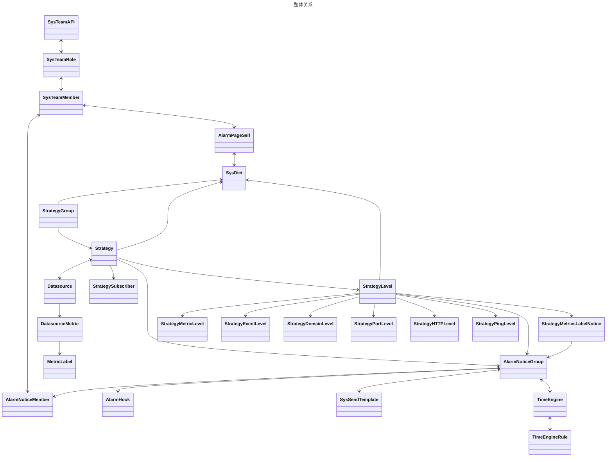

# 业务模型

## 整体关系

```mermaid
---
title: 整体关系
---

classDiagram
    SysTeamAPI <--> SysTeamRole
    SysTeamRole  <--> SysTeamMember

    SysDict <-- StrategyGroup 
    SysDict <-- Strategy

    SysTeamMember <--> AlarmNoticeMember
    SysTeamMember <--> AlarmPageSelf

    AlarmPageSelf <--> SysDict

    StrategyGroup --> Strategy

    Strategy <--> Datasource
    Strategy --> StrategySubscriber
    Strategy --> AlarmNoticeGroup
    Strategy --> StrategyLevel

    StrategyLevel --> StrategyMetricLevel
    StrategyLevel --> StrategyEventLevel
    StrategyLevel --> StrategyDomainLevel
    StrategyLevel --> StrategyPortLevel
    StrategyLevel --> StrategyHTTPLevel
    StrategyLevel --> StrategyPingLevel
    StrategyLevel --> SysDict
    StrategyLevel --> AlarmNoticeGroup
    StrategyLevel --> StrategyMetricsLabelNotice

    StrategyMetricsLabelNotice --> AlarmNoticeGroup

    Datasource --> DatasourceMetric
    DatasourceMetric --> MetricLabel
    
    AlarmNoticeGroup <--> AlarmNoticeMember
    AlarmNoticeGroup <--> AlarmHook
    AlarmNoticeGroup <--> SysSendTemplate
    AlarmNoticeGroup <--> TimeEngine

    TimeEngine <--> TimeEngineRule
```