# 业务模型

## 整体关系

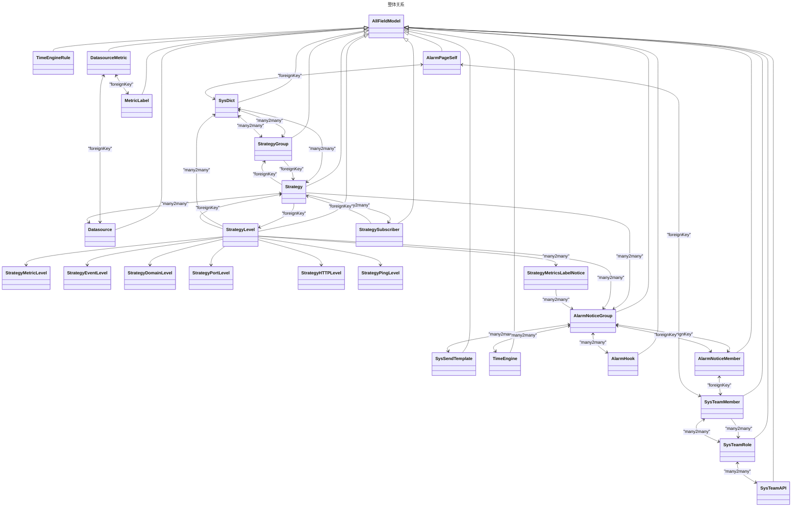
```mermaid
---
title: 整体关系
---

classDiagram
    AllFieldModel <|-- SysDict
    AllFieldModel <|-- SysSendTemplate
    AllFieldModel <|-- SysTeamAPI
    AllFieldModel <|-- SysTeamRole
    AllFieldModel <|-- SysTeamMember
    AllFieldModel <|-- TimeEngineRule
    AllFieldModel <|-- TimeEngine
    AllFieldModel <|-- StrategyGroup
    AllFieldModel <|-- Datasource
    AllFieldModel <|-- DatasourceMetric
    AllFieldModel <|-- MetricLabel
    AllFieldModel <|-- Strategy
    AllFieldModel <|-- StrategyLevel
    AllFieldModel <|-- StrategySubscriber
    AllFieldModel <|-- AlarmHook
    AllFieldModel <|-- AlarmNoticeGroup
    AllFieldModel <|-- AlarmNoticeMember
    AllFieldModel <|-- AlarmPageSelf

    SysDict <--> StrategyGroup : "many2many"
    SysDict <--> Strategy : "many2many"

    AlarmNoticeGroup <--> SysSendTemplate : "many2many"
    AlarmNoticeGroup <--> AlarmNoticeMember : "foreignKey"
    AlarmNoticeGroup <--> AlarmHook : "many2many"
    AlarmNoticeGroup <--> TimeEngine : "many2many"

    AlarmNoticeMember <--> AlarmNoticeGroup : "foreignKey"
    AlarmNoticeMember <--> SysTeamMember : "foreignKey"

    AlarmPageSelf <--> SysTeamMember : "foreignKey"
    AlarmPageSelf <--> SysDict : "foreignKey"

    DatasourceMetric <--> Datasource : "foreignKey"
    DatasourceMetric <--> MetricLabel : "foreignKey"

    StrategyGroup --> Strategy : "foreignKey"
    StrategyGroup <--> SysDict : "many2many"

    Strategy <--> Datasource : "many2many"
    Strategy --> StrategyGroup : "foreignKey"
    Strategy --> StrategyLevel : "foreignKey"
    Strategy --> StrategySubscriber : "many2many"
    Strategy --> AlarmNoticeGroup : "many2many"

    StrategyLevel --> StrategyMetricLevel
    StrategyLevel --> StrategyEventLevel
    StrategyLevel --> StrategyDomainLevel
    StrategyLevel --> StrategyPortLevel
    StrategyLevel --> StrategyHTTPLevel
    StrategyLevel --> StrategyPingLevel
    StrategyLevel --> SysDict : "many2many"
    StrategyLevel --> AlarmNoticeGroup : "many2many"
    StrategyLevel --> Strategy : "foreignKey"
    StrategyLevel --> StrategyMetricsLabelNotice : "many2many"

    StrategyMetricsLabelNotice --> AlarmNoticeGroup : "many2many"

    StrategySubscriber --> Strategy : "foreignKey"

    SysTeamMember --> SysTeamRole : "many2many"

    SysTeamRole <--> SysTeamAPI : "many2many"
    SysTeamRole <--> SysTeamMember : "many2many"
```

## 基础模型

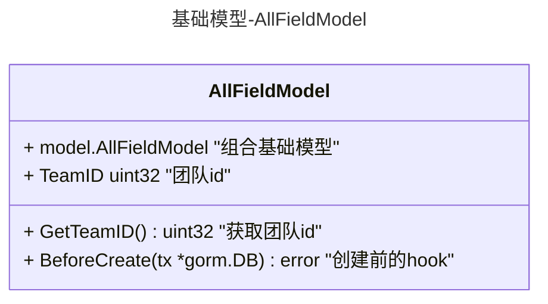
```mermaid
---
title: 基础模型-AllFieldModel
---

classDiagram
    class AllFieldModel {
        + model.AllFieldModel "组合基础模型"
        + TeamID uint32 "团队id"

        + GetTeamID() uint32 "获取团队id"
        + BeforeCreate(tx *gorm.DB) error "创建前的hook"
    }
```

## 字典模型

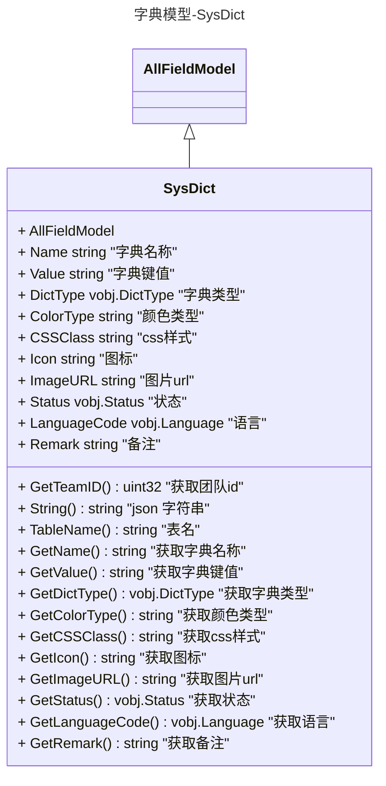
```mermaid
---
title: 字典模型-SysDict
---

classDiagram
   class SysDict {
        + AllFieldModel
        + Name string "字典名称"
        + Value string "字典键值"
        + DictType vobj.DictType "字典类型"
        + ColorType string "颜色类型"
        + CSSClass string "css样式"
        + Icon string "图标"
        + ImageURL string "图片url"
        + Status vobj.Status "状态"
        + LanguageCode vobj.Language "语言"
        + Remark string "备注"

        + GetTeamID() uint32 "获取团队id"
        + String() string "json 字符串"
        + TableName() string "表名"
        + GetName() string "获取字典名称"
        + GetValue() string "获取字典键值"
        + GetDictType() vobj.DictType "获取字典类型"
        + GetColorType() string "获取颜色类型"
        + GetCSSClass() string "获取css样式"
        + GetIcon() string "获取图标"
        + GetImageURL() string "获取图片url"
        + GetStatus() vobj.Status "获取状态"
        + GetLanguageCode() vobj.Language "获取语言"
        + GetRemark() string "获取备注"
    }

     AllFieldModel <|-- SysDict
```

## 发送模板模型

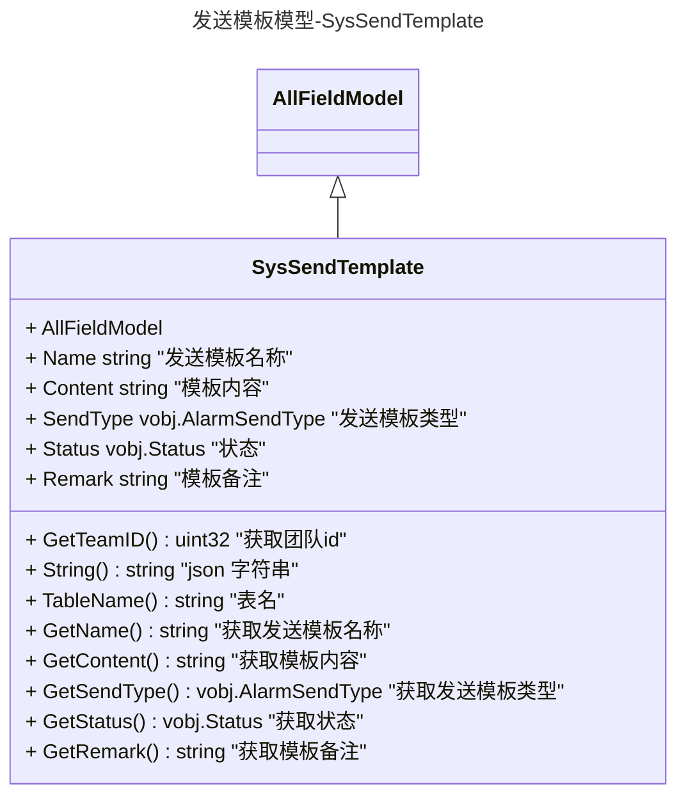
```mermaid
---
title: 发送模板模型-SysSendTemplate
---

classDiagram
    class SysSendTemplate {
        + AllFieldModel
        + Name string "发送模板名称"
        + Content string "模板内容"
        + SendType vobj.AlarmSendType "发送模板类型"
        + Status vobj.Status "状态"
        + Remark string "模板备注"

        + GetTeamID() uint32 "获取团队id"
        + String() string "json 字符串"
        + TableName() string "表名"
        + GetName() string "获取发送模板名称"
        + GetContent() string "获取模板内容"
        + GetSendType() vobj.AlarmSendType "获取发送模板类型"
        + GetStatus() vobj.Status "获取状态"
        + GetRemark() string "获取模板备注"
    }

    AllFieldModel <|-- SysSendTemplate
```

## 团队API模型

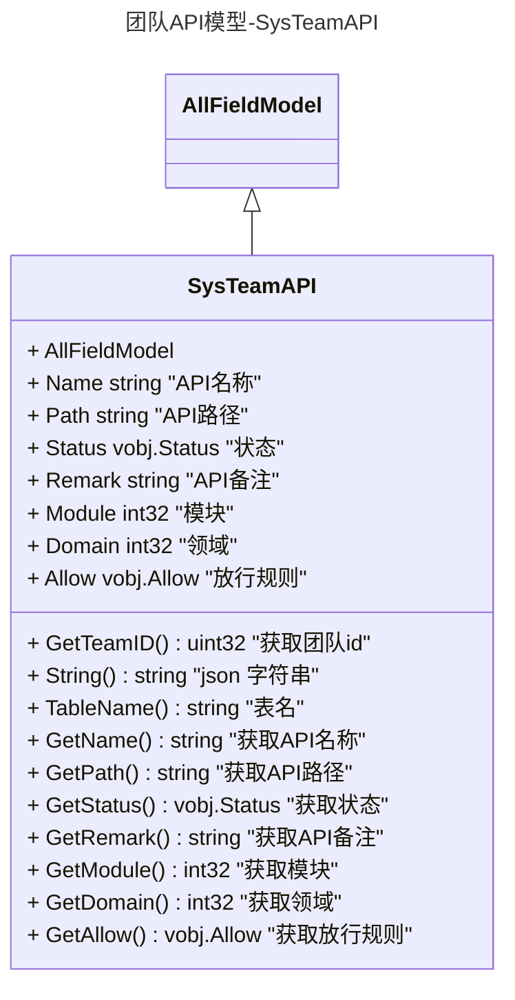
```mermaid
---
title: 团队API模型-SysTeamAPI
---

classDiagram
    class SysTeamAPI {
        + AllFieldModel
        + Name string "API名称"
        + Path string "API路径"
        + Status vobj.Status "状态"
        + Remark string "API备注"
        + Module int32 "模块"
        + Domain int32 "领域"
        + Allow vobj.Allow "放行规则"

        + GetTeamID() uint32 "获取团队id"
        + String() string "json 字符串"
        + TableName() string "表名"
        + GetName() string "获取API名称"
        + GetPath() string "获取API路径"
        + GetStatus() vobj.Status "获取状态"
        + GetRemark() string "获取API备注"
        + GetModule() int32 "获取模块"
        + GetDomain() int32 "获取领域"
        + GetAllow() vobj.Allow "获取放行规则"
    }

    AllFieldModel <|-- SysTeamAPI
```

## 团队角色模型

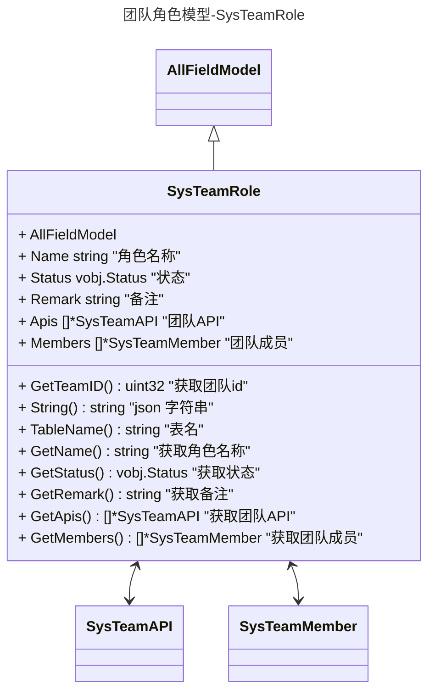
```mermaid
---
title: 团队角色模型-SysTeamRole
---

classDiagram
    class SysTeamRole {
        + AllFieldModel
        + Name string "角色名称"
        + Status vobj.Status "状态"
        + Remark string "备注"
        + Apis []*SysTeamAPI "团队API"
        + Members []*SysTeamMember "团队成员"

        + GetTeamID() uint32 "获取团队id"
        + String() string "json 字符串"
        + TableName() string "表名"
        + GetName() string "获取角色名称"
        + GetStatus() vobj.Status "获取状态"
        + GetRemark() string "获取备注"
        + GetApis() []*SysTeamAPI "获取团队API"
        + GetMembers() []*SysTeamMember "获取团队成员"
    }

    AllFieldModel <|-- SysTeamRole
    SysTeamRole <--> SysTeamAPI
    SysTeamRole <--> SysTeamMember
```

## 团队成员模型

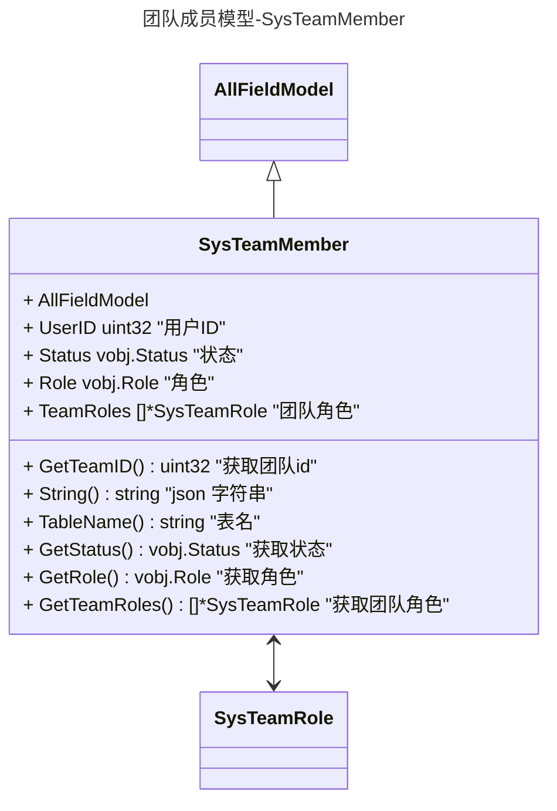
```mermaid
---
title: 团队成员模型-SysTeamMember
---

classDiagram
    class SysTeamMember {
        + AllFieldModel
        + UserID uint32 "用户ID"
        + Status vobj.Status "状态"
        + Role vobj.Role "角色"
        + TeamRoles []*SysTeamRole "团队角色"

        + GetTeamID() uint32 "获取团队id"
        + String() string "json 字符串"
        + TableName() string "表名"
        + GetStatus() vobj.Status "获取状态"
        + GetRole() vobj.Role "获取角色"
        + GetTeamRoles() []*SysTeamRole "获取团队角色"
    }

    AllFieldModel <|-- SysTeamMember
    SysTeamMember <--> SysTeamRole
```

## 时间引擎规则模型

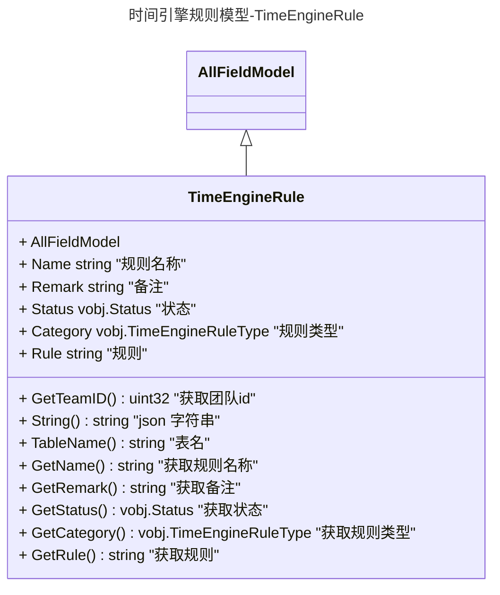
```mermaid
---
title: 时间引擎规则模型-TimeEngineRule
---

classDiagram
    class TimeEngineRule {
        + AllFieldModel
        + Name string "规则名称"
        + Remark string "备注"
        + Status vobj.Status "状态"
        + Category vobj.TimeEngineRuleType "规则类型"
        + Rule string "规则"

        + GetTeamID() uint32 "获取团队id"
        + String() string "json 字符串"
        + TableName() string "表名"
        + GetName() string "获取规则名称"
        + GetRemark() string "获取备注"
        + GetStatus() vobj.Status "获取状态"
        + GetCategory() vobj.TimeEngineRuleType "获取规则类型"
        + GetRule() string "获取规则"
    }

    AllFieldModel <|-- TimeEngineRule
```

## 时间引擎模型

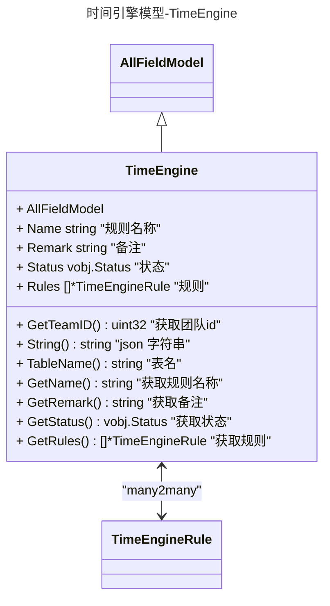
```mermaid
---
title: 时间引擎模型-TimeEngine
---

classDiagram
    class TimeEngine {
        + AllFieldModel
        + Name string "规则名称"
        + Remark string "备注"
        + Status vobj.Status "状态"
        + Rules []*TimeEngineRule "规则"

        + GetTeamID() uint32 "获取团队id"
        + String() string "json 字符串"
        + TableName() string "表名"
        + GetName() string "获取规则名称"
        + GetRemark() string "获取备注"
        + GetStatus() vobj.Status "获取状态"
        + GetRules() []*TimeEngineRule "获取规则"
    }

    AllFieldModel <|-- TimeEngine
    TimeEngine <--> TimeEngineRule : "many2many"
```

## 策略组模型

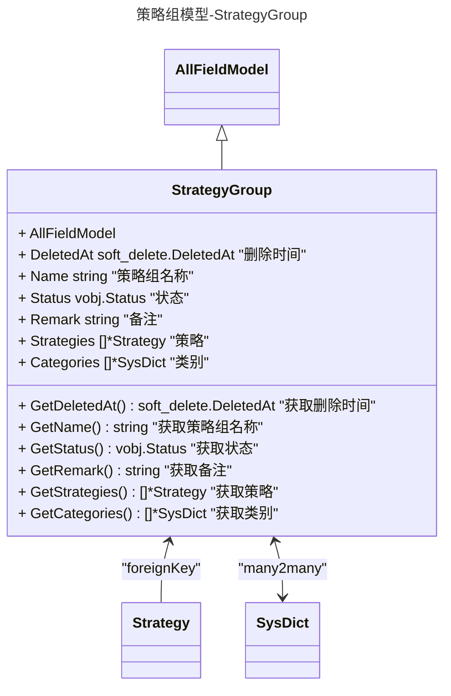
```mermaid
---
title: 策略组模型-StrategyGroup
---

classDiagram
    class StrategyGroup {
        + AllFieldModel
        + DeletedAt soft_delete.DeletedAt "删除时间"
        + Name string "策略组名称"
        + Status vobj.Status "状态"
        + Remark string "备注"
        + Strategies []*Strategy "策略"
        + Categories []*SysDict "类别"

        + GetDeletedAt() soft_delete.DeletedAt "获取删除时间"
        + GetName() string "获取策略组名称"
        + GetStatus() vobj.Status "获取状态"
        + GetRemark() string "获取备注"
        + GetStrategies() []*Strategy "获取策略"
        + GetCategories() []*SysDict "获取类别"
    }

    AllFieldModel <|-- StrategyGroup
    StrategyGroup <-- Strategy : "foreignKey"
    StrategyGroup <--> SysDict : "many2many"
```

## 数据源模型

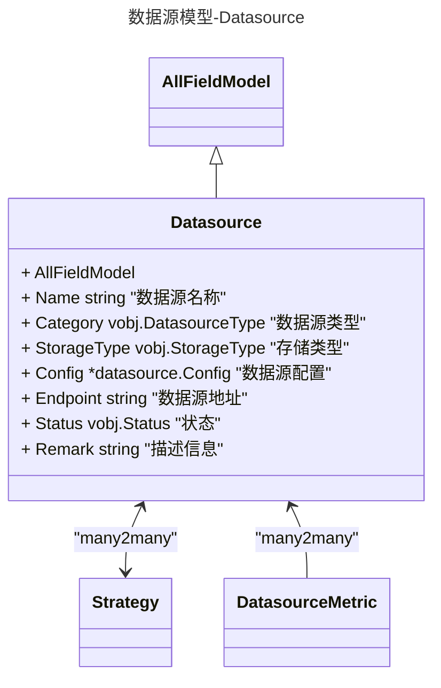
```mermaid
---
title: 数据源模型-Datasource
---

classDiagram
    class Datasource {
        + AllFieldModel
        + Name string "数据源名称"
        + Category vobj.DatasourceType "数据源类型"
        + StorageType vobj.StorageType "存储类型"
        + Config *datasource.Config "数据源配置"
        + Endpoint string "数据源地址"
        + Status vobj.Status "状态"
        + Remark string "描述信息"
    }

    AllFieldModel <|-- Datasource
    Datasource <--> Strategy : "many2many"
    Datasource <-- DatasourceMetric : "many2many"
```

## 数据源指标模型

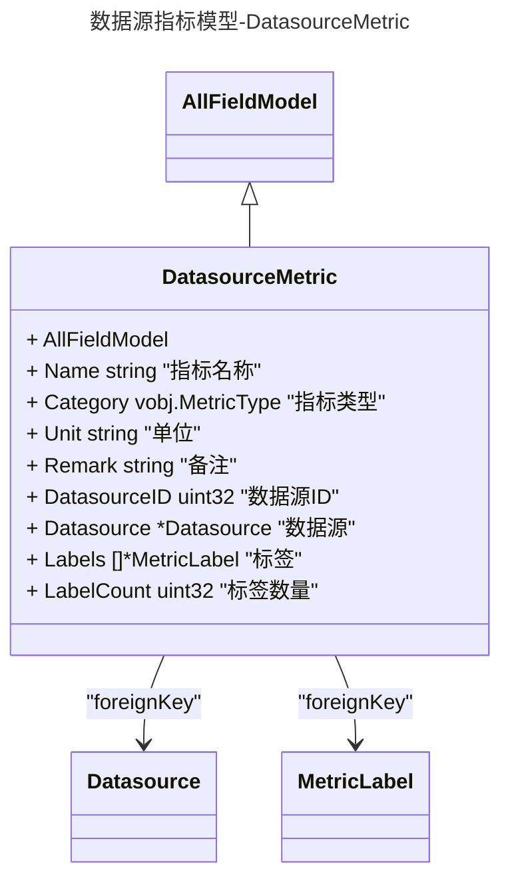
```mermaid
---
title: 数据源指标模型-DatasourceMetric
---

classDiagram
    class DatasourceMetric {
        + AllFieldModel
        + Name string "指标名称"
        + Category vobj.MetricType "指标类型"
        + Unit string "单位"
        + Remark string "备注"
        + DatasourceID uint32 "数据源ID"
        + Datasource *Datasource "数据源"
        + Labels []*MetricLabel "标签"
        + LabelCount uint32 "标签数量"
    }

    AllFieldModel <|-- DatasourceMetric
    DatasourceMetric --> Datasource : "foreignKey"
    DatasourceMetric --> MetricLabel : "foreignKey"
```

## 数据源指标标签模型

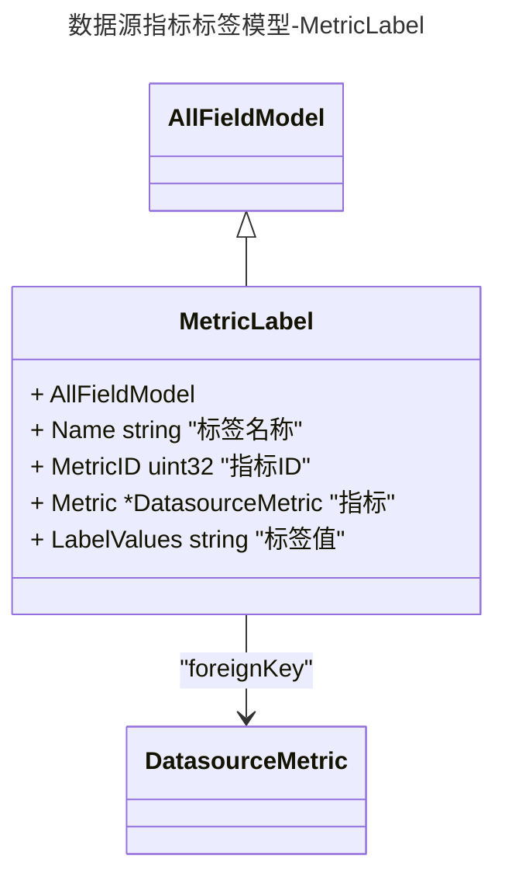
```mermaid
---
title: 数据源指标标签模型-MetricLabel
---

classDiagram
    class MetricLabel {
        + AllFieldModel
        + Name string "标签名称"
        + MetricID uint32 "指标ID"
        + Metric *DatasourceMetric "指标"
        + LabelValues string "标签值"
    }

    AllFieldModel <|-- MetricLabel
    MetricLabel --> DatasourceMetric : "foreignKey"
```

## 策略模型

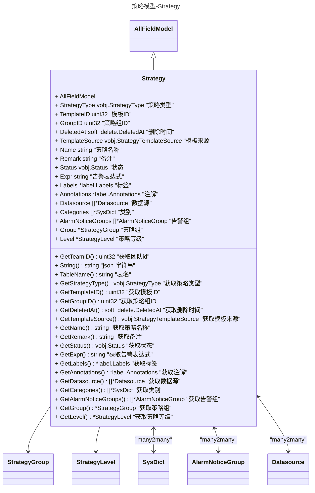
```mermaid
---
title: 策略模型-Strategy
---

classDiagram
    class Strategy {
        + AllFieldModel
        + StrategyType vobj.StrategyType "策略类型"
        + TemplateID uint32 "模板ID"
        + GroupID uint32 "策略组ID"
        + DeletedAt soft_delete.DeletedAt "删除时间"
        + TemplateSource vobj.StrategyTemplateSource "模板来源"
        + Name string "策略名称"
        + Remark string "备注"
        + Status vobj.Status "状态"
        + Expr string "告警表达式"
        + Labels *label.Labels "标签"
        + Annotations *label.Annotations "注解"
        + Datasource []*Datasource "数据源"
        + Categories []*SysDict "类别"
        + AlarmNoticeGroups []*AlarmNoticeGroup "告警组"
        + Group *StrategyGroup "策略组"
        + Level *StrategyLevel "策略等级"

        + GetTeamID() uint32 "获取团队id"
        + String() string "json 字符串"
        + TableName() string "表名"
        + GetStrategyType() vobj.StrategyType "获取策略类型"
        + GetTemplateID() uint32 "获取模板ID"
        + GetGroupID() uint32 "获取策略组ID"
        + GetDeletedAt() soft_delete.DeletedAt "获取删除时间"
        + GetTemplateSource() vobj.StrategyTemplateSource "获取模板来源"
        + GetName() string "获取策略名称"
        + GetRemark() string "获取备注"
        + GetStatus() vobj.Status "获取状态"
        + GetExpr() string "获取告警表达式"
        + GetLabels() *label.Labels "获取标签"
        + GetAnnotations() *label.Annotations "获取注解"
        + GetDatasource() []*Datasource "获取数据源"
        + GetCategories() []*SysDict "获取类别"
        + GetAlarmNoticeGroups() []*AlarmNoticeGroup "获取告警组"
        + GetGroup() *StrategyGroup "获取策略组"
        + GetLevel() *StrategyLevel "获取策略等级"
    }

    AllFieldModel <|-- Strategy
    Strategy --> StrategyGroup
    Strategy --> StrategyLevel
    Strategy <--> SysDict : "many2many"
    Strategy <--> AlarmNoticeGroup : "many2many"
    Strategy <--> Datasource : "many2many"
```

## 策略等级模型

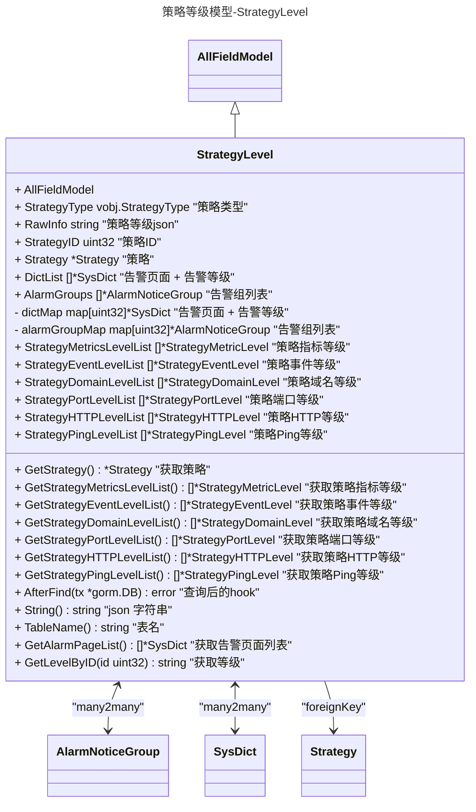
```mermaid
---
title: 策略等级模型-StrategyLevel
---

classDiagram
    class StrategyLevel {
        + AllFieldModel
        + StrategyType vobj.StrategyType "策略类型"
        + RawInfo string "策略等级json"
        + StrategyID uint32 "策略ID"
        + Strategy *Strategy "策略"
        + DictList []*SysDict "告警页面 + 告警等级"
        + AlarmGroups []*AlarmNoticeGroup "告警组列表"
        - dictMap map[uint32]*SysDict "告警页面 + 告警等级"
        - alarmGroupMap map[uint32]*AlarmNoticeGroup "告警组列表"

        + StrategyMetricsLevelList []*StrategyMetricLevel "策略指标等级"
        + StrategyEventLevelList []*StrategyEventLevel "策略事件等级"
        + StrategyDomainLevelList []*StrategyDomainLevel "策略域名等级"
        + StrategyPortLevelList []*StrategyPortLevel "策略端口等级"
        + StrategyHTTPLevelList []*StrategyHTTPLevel "策略HTTP等级"
        + StrategyPingLevelList []*StrategyPingLevel "策略Ping等级"

        + GetStrategy() *Strategy "获取策略"
        + GetStrategyMetricsLevelList() []*StrategyMetricLevel "获取策略指标等级"
        + GetStrategyEventLevelList() []*StrategyEventLevel "获取策略事件等级"
        + GetStrategyDomainLevelList() []*StrategyDomainLevel "获取策略域名等级"
        + GetStrategyPortLevelList() []*StrategyPortLevel "获取策略端口等级"
        + GetStrategyHTTPLevelList() []*StrategyHTTPLevel "获取策略HTTP等级"
        + GetStrategyPingLevelList() []*StrategyPingLevel "获取策略Ping等级"
        + AfterFind(tx *gorm.DB) error "查询后的hook"
        + String() string "json 字符串"
        + TableName() string "表名"
        + GetAlarmPageList() []*SysDict "获取告警页面列表"
        + GetLevelByID(id uint32) string "获取等级"
    }

    AllFieldModel <|-- StrategyLevel
    StrategyLevel <--> AlarmNoticeGroup : "many2many"
    StrategyLevel <--> SysDict : "many2many"
    StrategyLevel --> Strategy : "foreignKey"
```

## 策略订阅者模型

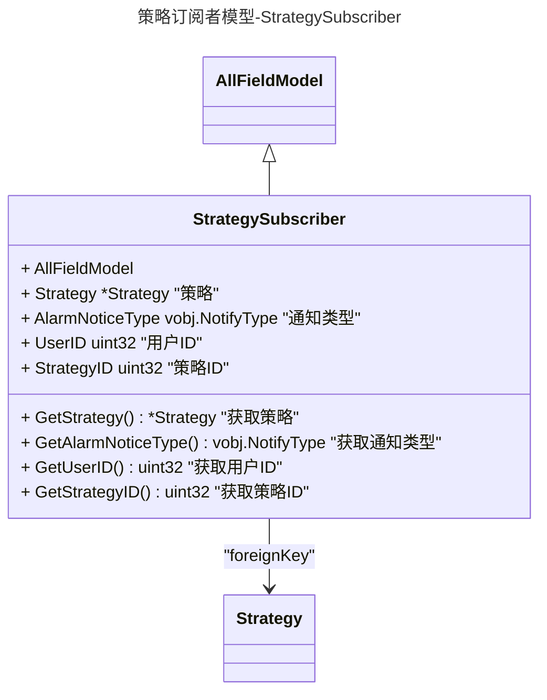
```mermaid
---
title: 策略订阅者模型-StrategySubscriber
---

classDiagram
    class StrategySubscriber {
        + AllFieldModel
        + Strategy *Strategy "策略"
        + AlarmNoticeType vobj.NotifyType "通知类型"
        + UserID uint32 "用户ID"
        + StrategyID uint32 "策略ID"    

        + GetStrategy() *Strategy "获取策略"
        + GetAlarmNoticeType() vobj.NotifyType "获取通知类型"
        + GetUserID() uint32 "获取用户ID"
        + GetStrategyID() uint32 "获取策略ID"
    }

    AllFieldModel <|-- StrategySubscriber
    StrategySubscriber --> Strategy : "foreignKey"
```

## 告警Hook模型

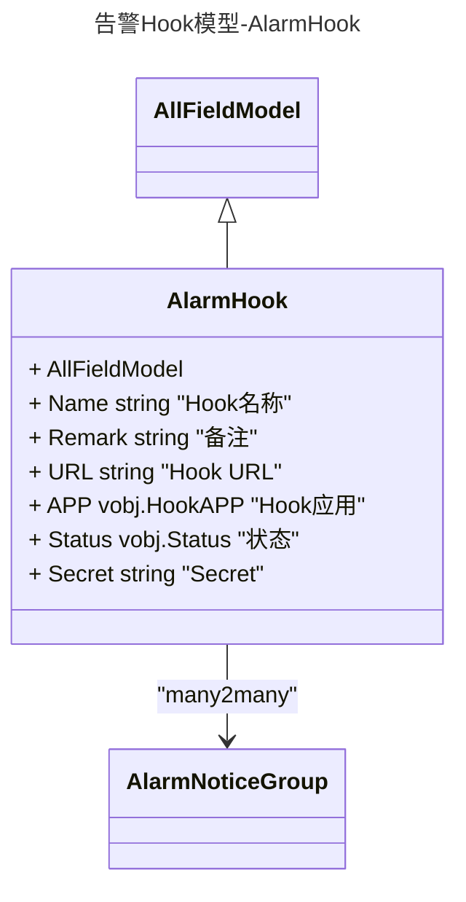
```mermaid
---
title: 告警Hook模型-AlarmHook
---

classDiagram
    class AlarmHook {
        + AllFieldModel
        + Name string "Hook名称"
        + Remark string "备注"
        + URL string "Hook URL"
        + APP vobj.HookAPP "Hook应用"
        + Status vobj.Status "状态"
        + Secret string "Secret"
    }

    AllFieldModel <|-- AlarmHook
    AlarmHook --> AlarmNoticeGroup : "many2many"
```

## 告警组模型

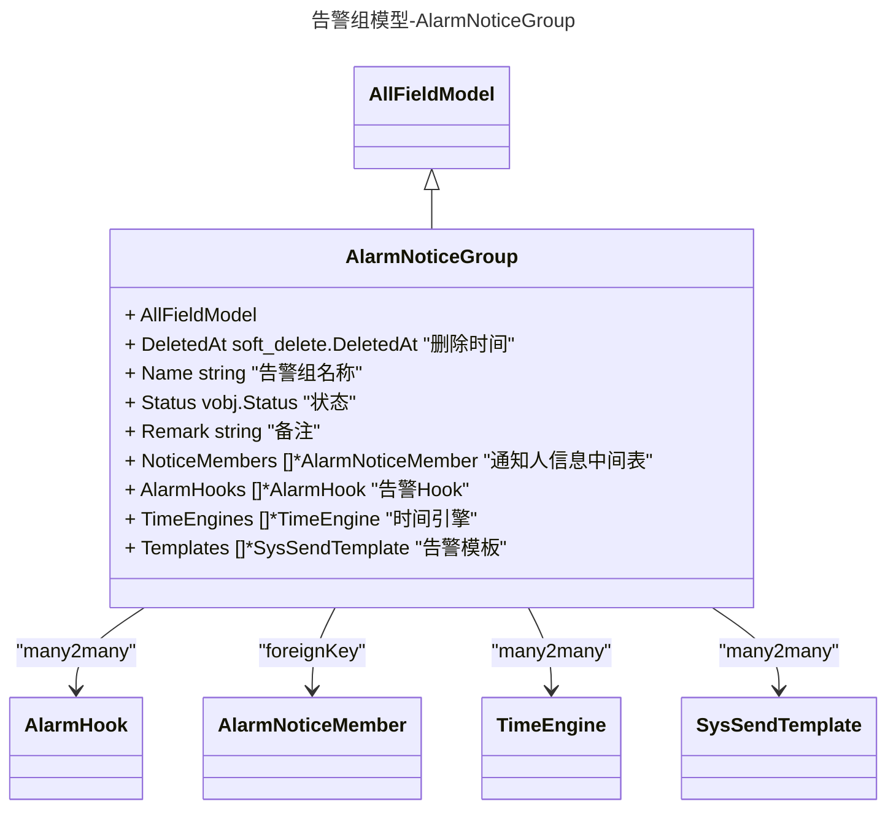
```mermaid
---
title: 告警组模型-AlarmNoticeGroup
---

classDiagram
    class AlarmNoticeGroup {
        + AllFieldModel
        + DeletedAt soft_delete.DeletedAt "删除时间"
        + Name string "告警组名称"
        + Status vobj.Status "状态"
        + Remark string "备注"
        + NoticeMembers []*AlarmNoticeMember "通知人信息中间表"
        + AlarmHooks []*AlarmHook "告警Hook"
        + TimeEngines []*TimeEngine "时间引擎"
        + Templates []*SysSendTemplate "告警模板"
    }

    AllFieldModel <|-- AlarmNoticeGroup
    AlarmNoticeGroup --> AlarmHook : "many2many"
    AlarmNoticeGroup --> AlarmNoticeMember : "foreignKey"
    AlarmNoticeGroup --> TimeEngine : "many2many"
    AlarmNoticeGroup --> SysSendTemplate : "many2many"
```

## 告警通知人模型

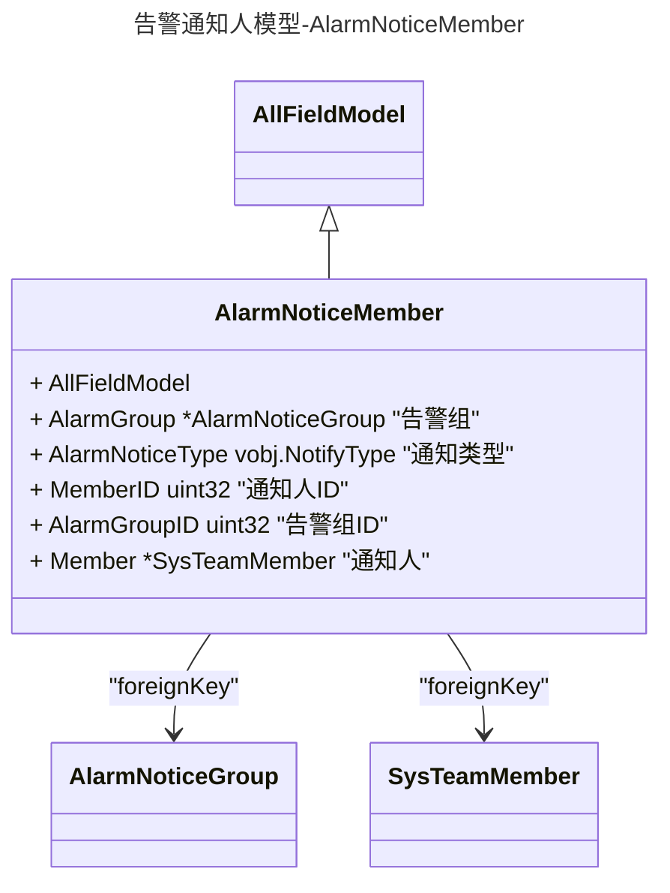
```mermaid
---
title: 告警通知人模型-AlarmNoticeMember
---

classDiagram
    class AlarmNoticeMember {
        + AllFieldModel
        + AlarmGroup *AlarmNoticeGroup "告警组"
        + AlarmNoticeType vobj.NotifyType "通知类型"
        + MemberID uint32 "通知人ID"
        + AlarmGroupID uint32 "告警组ID"
        + Member *SysTeamMember "通知人"
    }

    AllFieldModel <|-- AlarmNoticeMember
    AlarmNoticeMember --> AlarmNoticeGroup : "foreignKey"
    AlarmNoticeMember --> SysTeamMember : "foreignKey"
```

## 告警页面模型

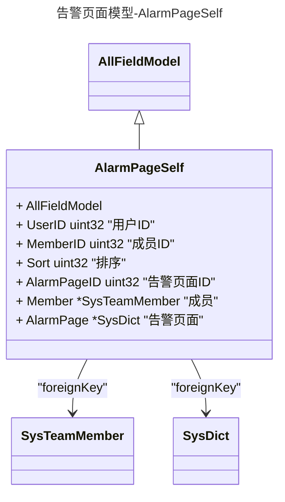
```mermaid
---
title: 告警页面模型-AlarmPageSelf
---

classDiagram
    class AlarmPageSelf {
        + AllFieldModel
        + UserID uint32 "用户ID"
        + MemberID uint32 "成员ID"
        + Sort uint32 "排序"
        + AlarmPageID uint32 "告警页面ID"
        + Member *SysTeamMember "成员"
        + AlarmPage *SysDict "告警页面"
    }

    AllFieldModel <|-- AlarmPageSelf
    AlarmPageSelf --> SysTeamMember : "foreignKey"
    AlarmPageSelf --> SysDict : "foreignKey"
```
